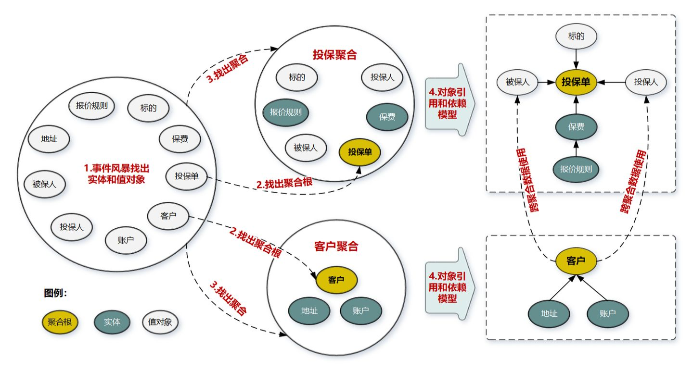
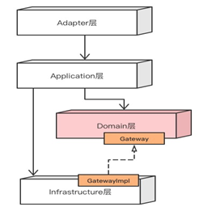

## 面向对象
### 1.面向对象编程的原则有哪些？
单一职责原则、里氏替换原则、迪米特原则、依赖倒转原则、接口隔离原则、开闭原则
````
- 单一职责原则：软件系统中的每个元素只完成自己职责范围内的事，而将其他的事交给别人去做，我只是去调用。
- 里氏替换原则通俗来讲就是：子类可以扩展父类的功能，但不能改变父类原有的功能。也就是说：子类继承父类时，除添加新的方法完成新增功能外，尽量不要重写父类的方法。
- 依赖倒置原则(Dependence Inversion Principle,DIP)是程序要依赖于抽象接口，不要依赖于具体实现。简单的说就是要求对抽象进行编程，不要对实现进行编程，这样就降低了客户与实现模块间的耦合。
- 接口隔离原则(Interface Segregation Principle, ISP)：使用多个专门的接口，而不使用单一的总接口，即客户端不应该依赖那些它不需要的接口。
  每一个接口应该承担一种相对独立的角色，不干不该干的事情，干该干的事请。
- 对扩展开放，对修改封闭（如何避免if else）
- 当两个类没有直接关系的时候，不应该彼此之间直接访问，而应该通过第三方代理类来访问。
````

### 2.面向对象的特点
封装，继承，多态（编译时多态：比如重载，运行时多态：比如重写）

### 3.高内聚低耦合
相同语义功能内聚，不同语义功能解耦合

### 4.设计模式
分为创建型模式和结构性模式两类。
- 工厂和单例模式属于创建型模式
- 桥接、适配器模式属于结构型模式

### 5.简单工厂、工厂方法和抽象工厂的区别
工厂方法和抽象工厂区别在于，工厂方法抽象的是方法具体实现来玩各自的事情，抽象工厂是抽象类由各自的实现类来操作。
而简单工厂就是继承父类并重写父类方法。

### 6.责任链模式
按照链式一个一个往后执行，抽象公共的上下文。

### 7.DDD模式
领域驱动模型，每个领域专注于自己的事情。使用充血模型，聚合根--领域模型--值对象   
聚合的设计原则： 高内聚，聚合尽量小，聚合之间通过id关联，边界之外使用最终一致性，在应用层实现跨聚合的调用。

通过事件风暴识别领域事件，决策命令，领域名词。识别限界上下文，根据业务相关性的统一语言。梳理好关系后，就可以划分子域。根据子域就可以来划分业务服务。划分好后，实行领域建模，也就是在其中我们可以知道各个子域的聚合根，聚合根和实体(有生命周期，支持增删改查)，值对象(不可变，描述作用)合成聚合。

比如：订单商品数据建模过程中的都有对象都是领域对象，其中订单是实体、商品是值对象、订单与订单明细是聚合，其中订单是聚合根。



````
聚合的特点：高内聚低耦合，是领域模型中最底层的边界，可以作为拆分微服务的最小单位，但是不建议单独对应一个微服务，除非是对性能有极致要求的场景，一个微服务可以包含多个聚合，聚合之间的边界是逻辑最天然的边界，有了这个逻辑边界，就可以在微服务拆分的时候作为拆分和组合依据，微服务架构演进也就不是难事了。

聚合根的特点：聚合根是实体，具备唯一标识，有独立的生命周期，一个聚合只有一个聚合根，聚合根在聚合之内采用引用依赖的方式对实体和值对象进行组织和协调，聚合根和聚合根之间通过唯一id进行聚合之间的协同；

实体的特点：具备id标识，可以通过id进行相等性比较，实体在聚合内唯一，但是状态可变，它依附于聚合根，它的生命周期由聚合根管理，实体一般都会持久化，跟数据持久化对象存在多种对应关系（一对一，一对多，多对一，1对0），实体可以引用聚合中的聚合根，实体，值对象；

值对象特点：无id,不可变，无生命周期，用完即失效，值对象之间通过属性值判断相等性，他的核心是值，是一组概念完整的属性集合，用于描述实体的特征和状态，值对象尽量只引用值对象；
````
结构：外部层--应用层--领域层--基础设施层



### CQRS和DCI
CQRS:Command Query Responsibility Segregation，故名思义是将 command 与 query 分离的一种模式。
- query 很好理解，就是我们之前提到的「查询」，「命令」(Command)则是对会引起数据发生变化操作的总称，即我们常说的新增，更新，删除这些操作，都是命令。

DCI:
- Data: What the system is. (static, structure)   实体：系统是什么（静态的结构）
- Role + Interaction: What the system does. (dynamic, behavior)   角色+交互：系统做什么（动态的行为）
- Context: Mapping the data to role, trigger the interaction. (the director) 上下文（场景）：将数据映射到角色，触发交互。(主管)

在DDD的基础上结合service+pojo方式使用贫血模型，将角色的行为剥离出实体，委托给场景来出发行为交互。
