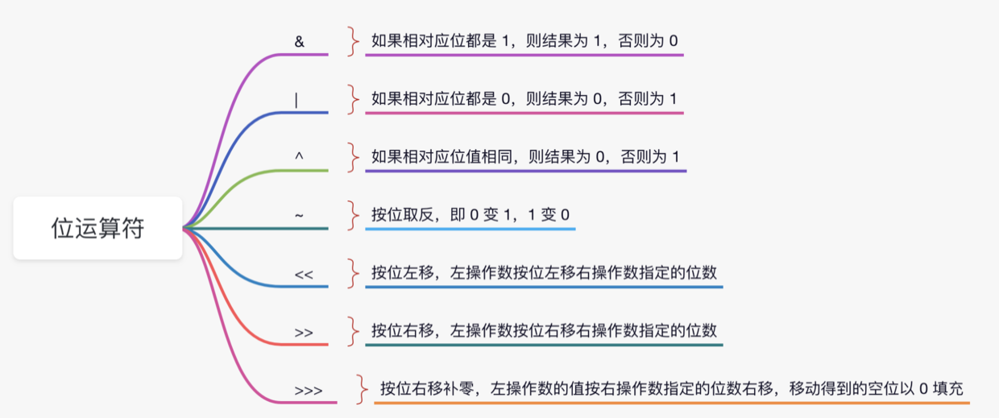
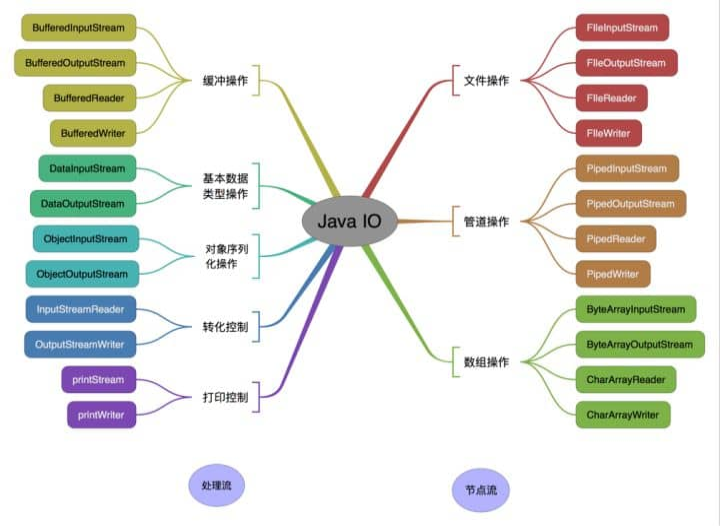
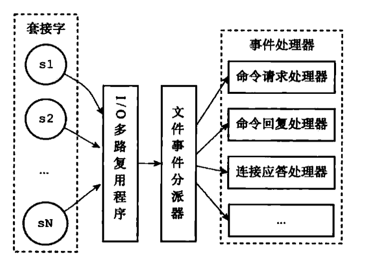
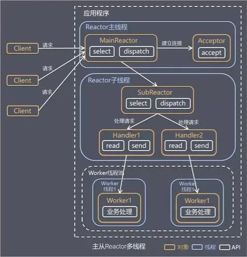

### 1.简述public、protected、private和不加修饰符的访问权限
- `private` : 私有成员, 在类的内部才可以访问。
- `protected` : 保护成员，该类内部和继承类中可以访问。
- `public` : 公共成员，完全公开，没有访问限制。
- `internal`: 在同一命名空间内可以访问。

### 2.基本类型和引用类型
(1) `byte`,`short`,`int`,`long`,`float`,`double`,`boolean`,`char`
````
byte：1字节    8位 -128~127

short ：2字节 16位

int ：4字节 32位   -2147483648~2147483647   带符号是2^31-1 ，不带符号是2^32-1，42亿个int值大概占用是16G

long：8字节 64位 -9223372036854775808 ~ 9223372036854775807

float：4个字节 32 位

double ：8个字节 64位

char：2个字节 16位

boolean: （true or false）1字节  8位

1kb = 1024字节(b byte) = 2^10b

ps: 无符号的int可以有42亿个数字，如果来表示bit的话就是42亿bit位，就是42亿/8/1024/1024=500M。
````
(2) class,interface,array
````
String:
字符串长度：字符串是由char[]来存储的，数组的长度和索引都是整数，所以受到Int大小的限制，所以最大为2^31-1大概是2G。但是在常量池中对String的定义是占2个字节2^16-1，由于JVM的结束指令占1位，所以是65534,超过这个长度编译时会报错。但是运行时拼接最大还是2^31-1
````

### 3.Object类的equals方法
直接判断`this`和`obj`本身的值是否相等，即用来判断调用`equals`的对象和形参`obj`所引用的对象是否是同一对象，所谓同一对象就是指内存中同一块存储单元，如果`this`和`obj`指向的同一块内存对象，则返回`true`,如果`this`和`obj`指向的不是同一块内存，则返回`false`,注意：即便是内容完全相等的两块不同的内存对象，也返回`false`。

### 4.this 逃逸问题
`this` 逃逸是指在构造函数返回之前其他线程就持有该对象的引用. 调用尚未构造完全的对象的方法可能引发令人疑惑的错误。

### 5.lambda
`lambda`是对函数式接口的语法糖，即只有一个抽象方法的接口。

运行时，会在类中生成一个匿名内部类实现这个函数式接口，并实现这个方法，这个方法会去调用一个根据`lambda`表达式中的代码生成的静态方法。

### 6.abstract class和interface的区别
声明方法的存在而不去实现它的类被叫做抽象类`（abstract class）`, `interface`实现类及`abstrct class`的子类都必须要实现已经声明的抽象方法，接口是一个绝对化的抽象。
- 抽象类要被子类继承，接口要被类实现。
- 抽象类主要用来抽象类别，接口主要用来抽象功能。
- 接口是个api标准，抽象类更像是一种模板，对代码重构简化。

### 7.Override和Overload的区别
方法的覆盖`(Override)`是指子类重写从父类继承（参数、返回值也同）,实在想用原来的可以用`super`，子类的访问权限要比父类相同或者大。构造方法不能被重写，但可以重载
- `overload` 重载 完全新的方法，参数和原方法不同。
- `override`  覆盖继承到的那个方法，那个方法仍然没有放弃。
- `overwrite` 重写继承到的那个方法的代码，原方法被放弃。重写后访问修饰符比之前相同或者更大。重写方法一定不能抛出新的检查异常或者更加宽泛的检查型异常。

### 8.final/finally/finalize的区别
- `final`用于声明属性，方法和类，分别表示属性不可交变，方法不可覆盖，类不可继承。 常量，不可修改
````
会加入写屏障，不会两步操作  常量会复制到需要用它的虚拟机栈中，超过最大值的会放入类的常量池中。

String Integer BigDecimal LocalDateTime 都是final类，而且是线程安全的，更新操作是会重新创建对象传入。
````
- `finally`是异常处理语句结构的一部分，表示总是执行。  finally中不能写return，会将异常throw吞掉
- `finalize`是Object类的一个方法，在垃圾收集器执行的时候会调用被回收对象的此方法，供垃圾收集时的其他资源回收，例如关闭文件流，网络连接等。从 JDK 9 开始被标记为`deprecated`，`Cleaner`接口将作为替代方案。

### 9.enum枚举
枚举类最终会被编译为被final修饰的普通类，他的属性都会被`static`和`final`关键字修饰。所以枚举类在`JVM`启动时就会被加载和初始化，这个过程是安全的，枚举也是线程安全的类。

### 10.单例模式
类声明为`final`的，构造器声明为`private`的，拥有一个`static`的类成员变量，同步的`getInstance`方法，尽量采用懒汉模式

关于单例，我们应该记住：线程安全，延迟加载，序列化与反序列化安全，反射安全是很重要。
- 1.使用静态内部类持有该对象
- 2.枚举实现单例  构造器私有，禁止反射，反序列化是通过`valueOf`方法，禁用了`writeObject`、`readObject`、`readObjectNoData`、`writeReplace`和`readResolve`等方法
  属于饿汉式，静态成员变量创建
````java
Person p1 = new Person();
byte[] bytes = SerializationUtils.serialize(p1);
Person p2 = (Person)SerializationUtils.deserialize(bytes);

p1和p2是两个对象。
````

### 11.为什么Date不安全，LocalDateTime是安全的
- 1.`Date`不安全
````
SimpleDateFormat的format方法调用时，calendar.setTime(date)如果是多线程调用会导致数据被篡改，因为calendar是公共变量。
SimpleDateFormat的parse方法也是线程不安全的，alb.establish(calendar)里的cal.clear()重置对象后再cal.set()放入值，并不是原子操作在多线程操作下会导致赋值错误。
办法：使用ThreadLocal保证每个线程最多只创建一次SimpleDateFormat对象
````
- 2.`LocalDateTime`安全
````
DateTimeFormatter是final类，成员变量也都是final修饰，不会被修改。parse方法中实际使用的DateTimeParseContext为方法的局部变量使得解析线程安全。
````

### 12.transient
用`transient`关键字标记的成员变量不参与序列化过程，`static` 变量因为不属于任何对象`(Object)`，所以无论有没有 `transient` 关键字修饰，均不会被序列化。

### 13.序列化
- 1.实现 `Serializable` 接口。生成一个序列号 serialVersionUID，这个序列号不是必需的。根据需求决定是否要重写 `writeObject()/readObject()`
方法，实现自定义序列化。调用 `java.io.ObjectOutputStream` 的 `writeObject()/readObject()`
进行序列化与反序列化。
- 2.`Apache Avro` 是一种与编程语言无关的序列化格式。`Avro` 依赖于用户自定义的 `Schema`，在进行序列化数据的时候，无须多余的开销，就可以快速完成序列化，并且生成的序列化数据也较小。当进行反序列化的时候，需要获取到写入数据时用到的 `Schema`。在 `Kafka`、`Hadoop` 以及 `Dubbo` 中都可以使用 `Avro` 作为序列化方案。对于大量消息数据有不错的表现。
- 3.`FastJson` 是阿里开源的 JSON 解析库，可以解析 `JSON` 格式的字符串。它支持将 Java 对象序列化为 `JSON` 字符串，反过来从 `JSON` 字符串也可以反序列化为 Java 对象
- 4.`Fst`（全称是 fast-serialization）是一款高性能 Java 对象序列化工具包
- 5.`Kryo` 是一个高效的 Java 序列化/反序列化库，提供了一套快速、高效和易用的序列化 API。无论是数据库存储，还是网络传输，都可以使用 `Kryo` 完成 Java 对象的序列化。`Kryo` 还可以执行自动深拷贝和浅拷贝，支持环形引用。
- 6.`Hessian2` 序列化是一种支持动态类型、跨语言的序列化协议，Java 对象序列化的二进制流可以被其他语言使用。`Dubbo` 中使用的 `Hessian2` 序列化并不是原生的 `Hessian2` 序列化，而是阿里修改过的 `Hessian Lite`
- 7.`Protobuf`（Google Protocol Buffers）是 Google 公司开发的一套灵活、高效、自动化的、用于对结构化数据进行序列化的协议。但相比于常用的 `JSON` 格式，`Protobuf`有更高的转化效率，时间效率和空间效率都是 `JSON` 的 5 倍左右。`Protobuf`可用于通信协议、数据存储等领域，它本身是语言无关、平台无关、可扩展的序列化结构数据格式。对于大量的小消息有极致的性能。

### 14.jsonpath
`JSONPath`是一种用于查询和操作JSON数据的表达式语言。它的设计灵感来自于`XPath`，用于`XML`数据的查询。`JSONPath`提供了一种简洁、易读的语法，用于表示`JSON`数据中的元素和属性，并允许用户通过表达式访问和操作这些元素。

`JSONPath`的原理可以分为以下几个部分：

表达式：`JSONPath`表达式是一种描述`JSON`数据结构中元素位置的字符串。表达式由一系列的操作符和标识符组成，用于表示`JSON`对象、数组和属性的层次结构。

例如，`$.store.book[0].title`表示访问名为`store`的对象中名为`book`的数组的第一个元素的`title`属性。
````
操作符：JSONPath支持多种操作符，用于表示JSON数据结构中的不同层次和关系。常见的操作符包括：
1，$：表示JSON数据的根元素。

2，@：表示当前元素。

3，.或[]：表示子元素。.用于访问对象的属性，[]用于访问数组的元素。

4，*：表示通配符，匹配所有元素。

5，..：表示递归下降，匹配所有子元素。

6，[start:end:step]：表示数组切片，用于访问数组的一部分元素。

7，[?(expression)]：表示过滤表达式，用于根据条件筛选元素。

解析和求值：JSONPath实现通常包括一个解析器和一个求值器。解析器负责将JSONPath表达式解析成一个抽象语法树（AST），AST表示表达式中的操作符和标识符的层次结构。求值器负责遍历AST，并根据操作符和标识符在JSON数据中查找和操作元素。
````

实现：`JSONPath`有多种编程语言的实现，如`JavaScript`、`Python`、`Java`等。这些实现通常提供了一组API，用于解析`JSONPath表达式`、`查询JSON数据`、`修改元素值`等。不同实现可能支持的操作符和功能略有不同，但基本原理相同。

总之，`JSONPath`的原理是通过一种简洁的表达式语言表示JSON数据结构中的元素位置，然后通过解析和求值这些表达式来访问和操作JSON数据。

### 15.什么时候使用cglib，什么时候使用jdk动态代理
`cglib`是类  `jdk`动态代理是接口
- `cglib`是使用`ClassWrite`来生成字节码文件，初始化`Enhancer类`，`MethodInterceptor接口`
- `jdk代理`是使用`Proxy.newProxyInstence`来生成字节码文件，实现`InvocationHandler接口`
````
java.lang.reflect.Proxy类和java.lang.reflect.InvocationHandler接口,Proxy类主要用来获取动态代理对象，InvocationHandler接口用来约束调用者实现invoke方法。
因为代理类生成时已经继承Prox类不支持多继承，所用只能用来代理接口。
````
- `Javassist`动态生成类，`ClassPool`来生成新的类，可以初始属性和方法，在方法中调用代理方法，就可以达到代理效果。

### 16.正向代理和反向代理
`「正向代理」`代理的对象是客户端，`「反向代理」`代理的对象是服务端（比如NG）

### 17.左移右移
左移是乘2的次方 <<    n << i == $( n * 2^{i} )$

右移是除2的次方 >>    n >> i == $( n / 2^{i} )$



### 18.泛型
泛型是编译期不执行具体类型，执行时检查类型的。在 java 中泛型只是一个占位符，必须在传递类型后才能使用。在编译阶段使用泛型，运行阶段取消泛型，即擦除。

类在实例化时才能真正的传递类型参数，由于静态方法的加载先于类的实例化，也就是说类中的泛型还没有传递真正的类型参数，静态的方法的加载就已经完成了，所以静态泛型方法是不能使用类上声明的泛型的，只能使用自己声明的。
````
在初始化泛型对象时，推荐使用 diamond 语法，代码如下：
return new PageDataVO<>(totalCount, dataList);
````

### 19.流处理
流处理就是连续、实时、并发和以逐条记录的方式处理数据的意思。

### 20.IO
- 按照流的流向分，可以分为输入流和输出流；
- 按照操作单元划分，可以划分为字节流和字符流；音频文件、图片等媒体文件用字节流比较好，如果涉及到字符的话使用字符流比较好。
- 按照流的角色划分为节点流和处理流。
````
InputStream/Reader: 所有的输入流的基类，前者是字节输入流，后者是字符输入流。
OutputStream/Writer: 所有输出流的基类，前者是字节输出流，后者是字符输出流。
````


### 21.BIO,NIO,AIO
- `BIO`是`阻塞式IO`  `blocking I/O`  阻塞式获取结果，调用者会等待结果。
- `NIO`是`非阻塞式IO`  `non-blocking I/O`   非阻塞式调用，不会阻塞主线程。NIO 既可以是同步的（通过循环检测）也可以是异步的（使用选择器）获取结果和状态。
````
相对于BIO,NIO可以一个线程负责连接等待，多个线程work执行。阻塞少，执行快。Accpet连接，distract发到各个处理hendle上
使用reactor模式，主从方式，主负责连接分发多从进行获取数据

零拷贝  使用byteBuffer将socket或者磁盘数据跳过复制到系统内存--》程序内存，直接放到程序内存和系统内存都能访问的区域（如：JVM直接内存）。Kafka是既然需要内核态到用户态来回复制，那就不要复制了我直接操作内核态就行，依赖lunix的sendfile()来操作。

Bug:Selector空转使得cpu到100%
````
- `AIO`是`异步IO`  `asynchronous I/O`  异步调用，当一个异步过程调用发出后，调用者不会立刻得到结果。而是在调用发出后，被调用者通过状态来通知调用者，或通过回调函数处理这个调用。

`非阻塞 IO` 系统调用 和 `异步 IO` 系统调用存在着一定的差别， 它们都不会阻塞进程， 但是返回结果的方式和内容有所差别， 但是都属于非阻塞系统调用`（ non-blocking system call ）`。

`NIO` 主要通过 `ByteBuffer`、`Channel` 和 `Selector` 等组件实现，

而 `AIO`则是通过 `Future` 等异步机制实现获取结果。




### 22.jdk11,jdk17,jdk21
<strong>
<p> jdk11</p>
</strong>

````
1、局部变量类型推断增强（Local-Variable Syntax for Lambda Parameters） ：在 JDK 10 中引入的局部变量类型推断 var 关键字，JDK 11 扩展了其用法，允许在 Lambda 表达式的参数中使用。
2、新的 HTTP 客户端 API ：引入了一个新的 java.net.http.HttpClient 类，提供了一个支持 HTTP/2 和 WebSocket 的现代 API，并且支持同步和异步操作。
3、改进的 Flight Recorder ：引入了低开销的堆分配采样方法，提供了更详细的 Java 堆分配信息。
4、字符串方法增强 ：新增了 isBlank(), strip(), stripLeading(), stripTrailing(), repeat(), 和行相关的方法如 lines() 等。
5、集合的增强 ：新增了集合的快速复制方法 copy()。
6、流 API 的扩展 ：新增了 takeWhile() 和 dropWhile() 方法。
7、新的垃圾收集器 ZGC（Z Garbage Collector） ：引入了 Z Garbage Collector，这是一个可扩展、低延迟的垃圾收集器，支持 TB 级别的堆内存。
8、启动单文件源代码程序 ：支持直接运行单一文件的 Java 源代码，无需先编译成 .class 文件。
9、Epsilon：无操作垃圾收集器 ：引入了一个完全消极的垃圾收集器实现，用于特定的基准测试和低内存占用场景。
10、应用类数据共享 ：改进了类数据共享机制，使用类数据归档和共享内存机制，减少了内存占用。JVM避免重复加载相同的类数据，减少程序启动时间。
11、弃用 Nashorn JavaScript 引擎 ：计划在未来版本中移除 Nashorn JavaScript 引擎。
12、JFR 和 JVM 监控改进 ：增强了 Java Flight Recorder 和 JVM 监控工具的功能。
````
<strong>
<p> jdk17</p>
</strong>

````
1、模式匹配增强（Pattern Matching for instanceof）：引入了对 instanceof 操作符的模式匹配支持，允许在条件语句中直接进行类型检查和类型转换，这简化了代码并减少了模板代码。
2、密封类（Sealed Classes）：密封类是一种不允许被未指定子类继承的类，这为控制类继承提供了一种新机制，有助于创建更安全和更易于维护的代码。
3、Record 类型：Record 类型是一种新的数据类型，本质也是类，用于创建不可变的数据载体类，具体类的特性，但它简化了数据类的定义，使得代码更加简洁。
4、Switch 表达式（Switch Expressions）：扩展了 switch 语句，允许它作为表达式使用，这使得 switch 语句更加灵活和强大。
5、文本块（Text Blocks）：文本块提供了一种新的字符串字面量形式，允许跨多行编写字符串，同时保持格式和可读性。
6、强封装 JDK 内部 API（Strongly Encapsulated JDK Internal APIs）：封装了 JDK 内部 API，减少了对 JDK 内部实现的依赖，提高了 JDK 的稳定性和安全性。
7、新的垃圾收集器 ZGC（Z Garbage Collector）：ZGC 是一个可伸缩的低延迟垃圾收集器，它支持 TB 级别的内存，同时保持低暂停时间。
8、弃用 Nashorn JavaScript 引擎：正式宣布弃用 Nashorn JavaScript 引擎，这是 JDK 11 中开始的一个过程。
9、弃用 Finalization：计划在未来版本中完全移除对象的 finalization 机制，因为它被认为是不可靠和不可预测的。JDK 9将finalize标记为弃用（deprecated），可以使用引入的Cleaner接口。
10、外部链接 API（Foreign Function & Memory API）：提供了一种机制，允许 Java 代码调用本地代码和操作内存，这对于与 C 语言库的互操作非常有用。
11、jdk15开始禁用偏向锁，因为使得synchronzation代码过于复杂，且优化性能提升不高。因为撤销锁的成本较高，需要等待全局安全点后暂停线程进行撤销锁。另外自旋锁成本降低。
````
<strong>
<p> jdk21</p>
</strong>

````
1、结构化并发 ：这是一种新的编程范式，旨在简化并发编程，通过结构化的方法来创建、执行和完成并发任务，使得并发代码更容易理解和调试。
2、作用域值 ：这是 JDK 20 中引入的功能，允许创建受限于特定线程或任务的值，类似于线程本地变量，可以与虚拟线程和结构化并发一起使用。
3、虚拟线程 ：来自 Project Loom，虚拟线程得到了进一步的完善，它们是轻量级的线程实现，可以显著减少编写、维护和观察高吞吐量并发应用程序的工作量。
4、序列集合接口 ：引入了新的接口 SequencedCollection 和 SequencedMap，为集合类提供了顺序性操作的支持。
5、字符串模板 ：这是 一个预览功能，通过结合字面文本与嵌入式表达式和处理器，简化了 Java 程序中字符串的编写。
6、Java 程序集 ：引入了一种新的模块化方式，通过 java.assembly 模块支持，使得开发者能够更轻松地组织和管理大型项目中的代码。
7、增强的模式匹配 ：在 Java 17 引入的模式匹配基础上，进一步改进了对 instanceof 的模式匹配支持。
8、改进的异常处理 ：引入了一些改进的异常处理机制，使得开发者能够更清晰地管理和处理异常情况。
9、并发随机数生成器 ：提供了一种并发安全的随机数生成器，适用于多线程环境。
10、本地类型推断增强 ：增强了本地类型推断，使得开发者能够更灵活地使用 var 关键字进行类型推断。
11、增强的属性支持 ：增强了 Java 平台的属性支持，使得开发者能够更轻松地操作和管理属性。
12、基于 Java 命令行工具的包管理工具 ：提供了基于 Java 命令行工具的包管理工具，方便开发者管理和使用第三方库。
13、分代ZGC：对 Z Garbage Collector 进行了改进，增加了分代功能，提供了一种更多的策略来观察对象，以进一步提升性能。
14、准备禁止动态加载代理：动态加载代理可以在运行时修改应用程序的行为，这可能导致安全问题。
15、JMS支持：这是 Oracle 云基础设施远程软件服务（OCI）的一项服务，提供统一的控制台和仪表盘来帮助企业管理 Java 运行时和应用程序。
````
