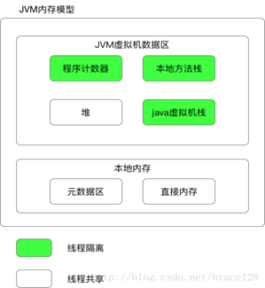
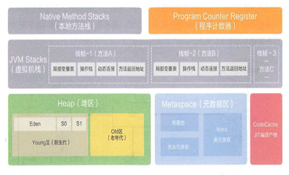
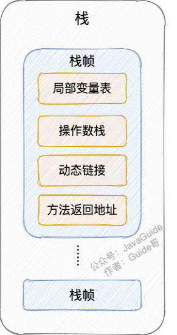
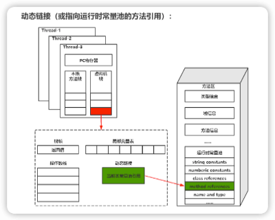
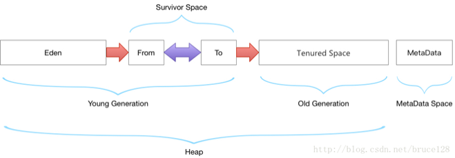

# JVM内存区域



<strong>
<p>堆是先进先出,栈是先进后出。栈管运行，堆管存储。则虚拟机栈负责运行代码，而虚拟机堆负责存储数据。</p>
</strong>

**异常：**
1. `堆溢出`：对象持续放入且有引用无法回收，大对象没有空间，`GCoverheadLimit` 98%的时间只回收了2%的空间 `OOM:heap space`
2. `栈溢出`：循环创建局部变量，递归没有出口 `statckoverflowError`
3. `元数据溢出`：大量类的创建和加载，很难出现因为元数据存在操作系统的内存中。 `OOM:meta space`
4. `直接内存溢出`：`OOM:directmemory`

````
tips: oom不会导致java进程结束。
````
## 栈
<strong>
<p>栈：局部变量表，操作数栈，动态链接，方法出口等信息，由栈帧组成，栈帧就是调用方法占用内存存储的局部变量返回地址等，每个线程只能有一个活动栈帧，对应着正在执行的方法  线程私有 ，互不干扰。</p>
</strong>

1. `局部变量表` 主要存放了编译期可知的各种数据类型（`boolean`、`byte`、`char`、`short`、`int`、`float`、`long`、`double`）、对象引用（reference 类型，它不同于对象本身，可能是一个指向对象起始地址的引用指针，也可能是指向一个代表对象的句柄或其他与此对象相关的位置）。
2. `操作数栈` 主要作为方法调用的中转站使用，用于存放方法执行过程中产生的中间计算结果。另外，计算过程中产生的临时变量也会放在操作数栈中。
3. `动态链接` 主要服务一个方法需要调用其他方法的场景。在 Java 源文件被编译成字节码文件时，所有的变量和方法引用都作为符号引用（Symbilic Reference）保存在 Class 文件的常量池里。当一个方法要调用其他方法，需要将常量池中指向方法的符号引用转化为其在内存地址中的直接引用。动态链接的作用就是为了将符号引用转换为调用方法的直接引用。

<strong>8种基本类型的变量+对象的引用变量+实例方法都是在栈里面分配内存。</strong>





## 堆
<strong>
<p>堆：放的是对象的实例，字符串常量池。共享</p>
</strong>

<strong>
<p>Eden:FromSurvivor:ToSurvivor = 8:1:1</p>
</strong>




## 堆外内存（本地内存）
`元数据区（metaSpace）`和`直接内存`

1. `元数据区`： 运行时常量池，已被虚拟机加载的 类信息、字段信息、方法信息、常量、静态变量，即时编译器编译后的代码缓存等数据。`OOM:meta space`

2. `直接内存`： 用于加速JVM运行，就是在堆外开辟一块内存存放数据，避免切换造成的性能降低（如： `NIO`中使用`DriectByteBuffer`对其进行操作避免了在 `Java 堆`和 `Native 堆`之间来回复制数据）。`OOM:directmemory`

>直接内存是同过unsafe类来管理的，setMemory/freeMemory。lunix系统中命令是mmap()和munmap()
````
tips：
如果没有设置 -XX:MaxDirectMemorySize的限制，JVM不会主动回收直接内存的，会动态分配直接内存，这样可能导致直接内存一直增大OOM:directmemory。只有等待堆内存进行FullGC时才会顺带回收直接内存。但是设置 -XX:MaxDirectMemorySize，JVM会在直接内存达到阈值时进行一次FullGC来回收直接内存。
````

## 常用查看jvm命令
1. `jps`查询 java进程数据
3. `jstack`栈信息
4. `jstatGC`信息
5. `jmap`堆信息
6. `jconsole`图形多功能，可连续监测的工具
7. `jvisualVM`可视化虚拟机监测，可扩展插件
8. `javap` 反编译字节码文件
9. `MAT`工具分析对象
10. `LeakCanary`是轻量级的第三方内存泄漏检测工具

>`内存泄漏`是申请的内存无法回收。
`内存溢出`是申请内存空间无法分配空间大小。

````
 1. Oom时dump:-XX:+HeapDumpOnOutOfMemoryError
 2. jmap -dump:format=b,file=heapdump.hprof <pid>
````


