# GC

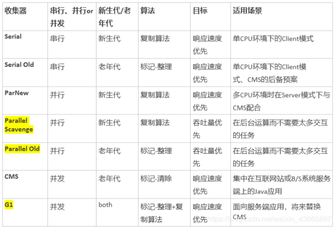

## 请简述一下分代垃圾收集法？为什么要进行分代收集

> 在不进行对象存活时间区分的情况下，每次垃圾回收都是对整个堆空间进行回收，花费时间相对会长，同时，因为每次回收都需要遍历所有存活对象，但实际上，对于生命周期长的对象而言，这种遍历是没有效果的，因为可能进行了很多次遍历，但是他们依旧存在。因此，分代垃圾回收采用分治的思想，进行代的划分，把不同生命周期的对象放在不同代上，不同代上采用最适合它的垃圾回收方式进行回收

> **GC的年代标识在对象头的markword中,4Bit（15）**

## 新生代和老年代

>新生代和老年代配比 1：2

**新生代进入老年代：**
1. 对象由新生代进入老年代
2. 躲过15次minor gc之后放入老年代，
3. 大对象直接进入老年代 -XX:PretenureSizeThreshold，
4. 老年代空间分配担保规则给年轻代，
5. 无法放入Survivor区的年轻代

## 年轻代的Eden区和Survivor区的区别
>

>Eden中的对象当放不下后，会进行MinorGC(Young GC)，将存活的对象放入ToSurvivor中，然后清除Eden和FromSurvivor区，并将From和To进行交换，新的"From"就是上次 GC 前的"To"，保证名为 To 的 Survivor 区域是空的。对象年龄加1。
年龄加到15会进入老年代（Hotspot 遍历所有对象时，按照年龄从小到大对其所占用的大小进行累积，当累积的某个年龄大小超过了 survivor 区的一半时，取这个年龄和 MaxTenuringThreshold 中更小的一个值，作为新的晋升年龄阈值），有可能当次 Minor GC 后，Survivor 的"From"区域空间不够用，有一些还达不到进入老年代条件的实例放不下，则放不下的部分会提前进入老年代。
````
MinorGC 前，虚拟机必须检查老年代最大可用连续空间是否大于新生代对象总空间，如果满足则说明这次 Minor GC 确定安全。如果不，JVM会查看HandlePromotionFailure 参数是否允许担保失败，如果允许会继续检查老年代最大可用连续空间是否大于历次晋升老年代对象的平均大小，如果满足将Minor GC，否则改成一次 FullGC。
````
>**Eden:From:To 一般配比 8:1:1**

>**Young GC的时候，STW**
````
TLAB的全称是Thread Local Allocation Buffer，即线程本地分配缓存区，这是一个线程专用的内存分配区域。在线程初始化时，同时也会申请一块指定大小的内存，只给当前线程使用，这样每个线程都单独拥有一个空间，如果需要分配内存，就在自己的空间上分配，这样就不存在竞争的情况，可以大大提升分配效率。
TLAB空间的内存非常小，缺省情况下仅占有整个Eden空间的1%。占用eden区，需要有整理。
````

## 如何查找内存中不再使用的对象
1. 引用计数法：引用计数法就是如果一个对象没有被任何引用指向，则可视之为垃圾。这种方法的缺点就是不能检测到循环引用的存在。
2. 可达性分析算法：通过一系列名为“GC Roots”的对象作为起始点，从这些节点开始向下搜索，未被该集合引用到的对象.。

>使在可达性分析法中不可达的对象，也并非是“非死不可”的，这时候它们暂时处于“缓刑阶段”，要真正宣告一个对象死亡，至少要经历两次标记过程；可达性分析法中不可达的对象被第一次标记并且进行一次筛选，筛选的条件是此对象是否有必要执行 finalize 方法。当对象没有覆盖 finalize 方法，或 finalize 方法已经被虚拟机调用过时，虚拟机将这两种情况视为没有必要执行。
`（jdk9以后减少对finalize依赖，使用Cleaner接口替代）`

>被判定为需要执行的对象将会被放在一个队列中进行第二次标记，除非这个对象与引用链上的任何一个对象建立关联，否则就会被真的回收。

**GC Roots:**
- Java虚拟机栈的局部变量引用的对象
- 静态属性引用的对象
- 常量池中引用的对象
- 本地方法栈中JNI引用对象
- 所有被同步锁（synchronized）持有的对象
- 启动类加载器加载的核心类的对象
- 活动线程引用的对象
- JVM内部引用的对象

**引用关系类型：**
- `强引用`
- `软引用` `SoftReference`描述有些还有用但并非必需的对象。在系统将要发生内存溢出异常之前，将会把这些对象列进回收范围进行二次回收
- `弱引用` `WeakReference` 描述非必需对象。被弱引用关联的对象只能生存到下一次垃圾回收之前，垃圾收集器工作之后，无论当前内存是否足够，都会回收掉只被弱引用关联的对象 ThreadLocal类 WeakHashMap：当某个键不再正常使用时，会从WeakHashMap中被自动移除，可以节省内存
- `虚引用` `PhantomReference` 这个引用存在的唯一目的就是在这个对象被收集器回收时收到一个系统通知，被虚引用关联的对象，和其生存时间完全没关系。主要的作用是提供了一个感知对象被垃圾回收的机制。 比如jdk9的Cleaner类就是用虚引用实现的回收类，可以通过通知回调run方法，释放直接内存的空间。
- `终结器引用` `FinalRefernce`
- `引用队列` `ReferneceQueue`

## 如何触发GC

1. Eden区不够，新生代 minorgc(Young GC)
2. 老年代 fullgc
3. 显示调用System.gc， -XX:DisableExplictGC 禁用显示的GC。这个会直接STW，不建议使用
4. 内存空间不够

## 什么情况下会触发Full GC

1. 老年代空间不足（可能会先触发MinorGC(Young GC),仍不足FullGC） 浮动垃圾过多，没有连续空间给大对象，对象放不进新生代也放不进老年代
2. 永久代空间不足（1.6及之前）
3. 显示调用System.gc  只会把这次gc请求记录下来，等到runFinalization=true的时候才会先去执行GC，允许一次  `-XX:DisableExplictGC` 禁用显示的GC
4. YGC出现promotion failure 对象晋升失败

>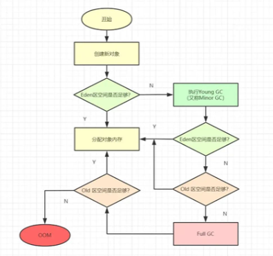

## 年轻代默认使用什么样的垃圾收集器
Serial（单） ParNew（多）  标记-整理

## 垃圾回收算法
**分代回收：**
1. 新生代：复制算法，只有少量对象存活，效率高，占用空间  eden和FromSurvivor,toSurvivor。G1的Young GC和CMS的Young GC，其标记-复制全过程STW。
2. 老年代：标记清除/标记整理算法。效率低。

**划区域(Region)回收：**
1. ZGC：Region 的大小可以动态变化，范围从 2MB 到 32MB。
2. G1: Region 大小固定，有多种不同的大小。

**首先GC分两类，Partial GC（部分回收）、Full GC:**
1. Partial GC：并不收集整个GC堆的模式，以下全是Partial GC的子集
   - （1）Young GC：只收集young gen的GC
   - （2）Old GC：只收集old gen的GC。只有CMS的concurrent collection是这个模式。
   - （3）Mixed GC：只有G1有这个模式，收集整个young gen以及部分old gen的GC。
   - （4）Minor GC：只有G1有这个模式，收集整个young gen
2. Full GC：收集整个堆，包括young gen、old gen、perm gen（如果存在的话）等所有部分的模式。Major GC：通常是跟Full GC是等价的。

**要么最求吞吐量，要么最短停顿时间。**
````
吞吐量大，就是用户任务线程CPU利用率高，可用于回收GC的线程CPU利用率就会低，GC慢造成延长STW时间。
最短停顿时间，GC线程占用CPU资源多，会造成用户任务线程执行慢，吞吐量降低。
````
**衡量垃圾收集器的三项最重要的指标是：内存占用（Footprint）、吞吐量（Throughput）和延迟（Latency），三者共同构成了一个“不可能三角”**

>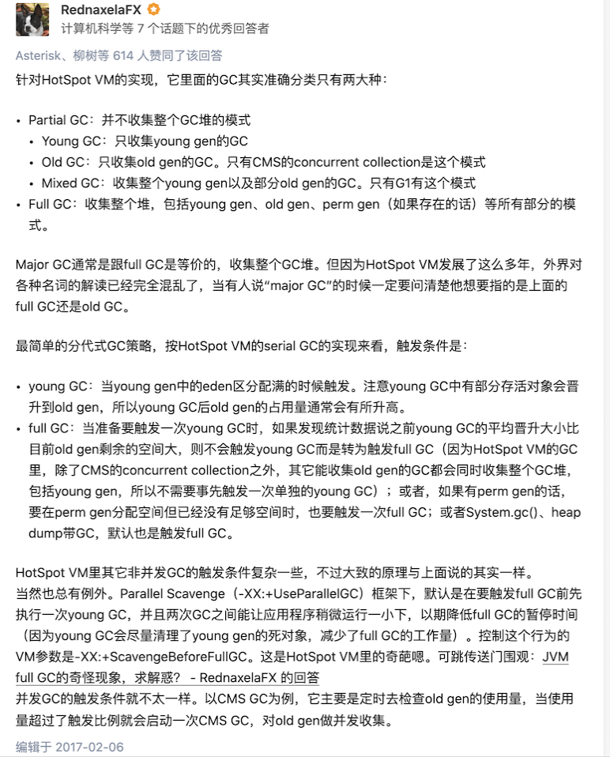

## CMS（Concurrent Mark Sweep）垃圾收集法
**CMS标记-清除：**
1. 阶段1：初始标记(CMS initial mark) -stop the world 标记GCRoots能直接关联到的对象，时间很短。
2. 阶段2：并发标记(CMS concurrent mark) 对GCRoots进行Tracing（可达性分析）过程，时间很长。为了提高重新标记的效率，并发标记阶段会把这些发生变化的对象加入写屏障，放入CardTable标识为Dirty，这样重新标记就只需要扫描这些脏卡(Dirty Card)的对象，从而避免扫描整个老年代。
3. 阶段3：重新标记(CMS remark) -stop the world 修正并发标记期间因用户程序继续运作而导致标记产生变动的那一部分对象的标记记录，时间较长。
4. 阶段4：并发清除(CMS concurrent sweep) 回收内存空间，时间很长。
>整个过程耗时最长的并发标记和并发清除过程，收集器都可以与用户线程一起工作。总体上来说，CMS收集器的内存回收过程与用户线程一起并发执行的。
````
CMS并发的代价：  消耗CPU
预留空间给用户，预留不足的时候触发FUllGC
标记-清除算法导致空间碎片，则没有连续空间分配大对象时 FUllGC。碎片过多会导致CMS退为SerialOld GC 串行，标记-整理
````

**缺点：**
1. 对 CPU 资源敏感；
2. 无法处理浮动垃圾( Floating Garbage),可能出现“Concurrent ModeFailure”失败而导致另一次 Full GC的产生；
3. 它使用的回收算法-“标记-清除”算法会导致收集结束时会有大量空间碎片产生，以至于老年代还有大量空间，却没有整块空间存储某对象。

**CMS优化:CMS优化  最快的GC就是不发生GC**
1. `垃圾碎片的问题`，
>我们都知道CMS是使用的是标记-清除算法的，所以不可避免的就是会出现垃圾碎片的问题。
需要用到这个参数：-XX:CMSFullGCsBeforeCompaction(压缩)=n 意思是说在上一次CMS并发GC执行过后，到底还要再执行多少次full GC才会做压缩。默认是0，也就是在默认配置下每次CMS GC顶不住了而要转入fullGC的时候都会做压缩。会和UseCMSCompactAtFullCollection(整理算法)搭配使用的默认就是true，整理碎片。
2. `一般CMS的GC耗时80%都在remark阶段，remark阶段停顿时间会很长`，
>在CMS的这四个主要的阶段中，最费时间的就是重新标记阶段。remark阶段停顿时间会很长的问题：解决这个问题巨简单，加入-XX:+CMSParallelRemarkEnabled和-XX:+CMSScavengeBeforeRemark。在执行remark操作之前先做一次Young GC，目的在于减少年轻代对老年代的无效引用，降低remark时的开销。
3. `concurrent mode failure`，
>这个异常发生在cms正在回收的时候。执行CMS GC的过程中，同时业务线程也在运行，当年轻带空间满了，执行ygc时，需要将存活的对象放入到老年代，而此时老年代空间不足，这时CMS还没有机会回收老年代产生的，或者在做MinorGC的时候，新生代救助空间放不下，需要放入老年代，而老年代也放不下而产生的。
解决方法，两个参数即可-XX:+UseCMSInitiatingOccupancyOnly 和 -XX:CMSInitiatingOccupancyFraction=60：是指设定CMS在对内存占用率达到60%的时候开始GC。由于在垃圾收集阶段用户线程还需要运行，那么就还需要预留有足够的内存空间给用户线程使用，因此CMS收集器不能像其他收集器那样等到老年代几乎完全被填满了再进行收集，CMS会有浮动垃圾,所以一般都较早启动GC。
4. `promotion failed`，
>这个问题是指在进行Minor GC时，Survivor空间不足，对象只能放入老年代，而此时老年代也放不下造成的，多数是由于老年代有足够的空闲空间，但是由于碎片较多，新生代要转移到老年代的对象比较大,找不到一段连续区域存放这个对象导致的。碎片化问题又回到了第一个问题中。

**其他优化：**
1. 新生代回收快，调高晋升阈值：`-XX:MaxTenuringThreshold`
2. 调线程数 `-XX:ParallelCMSThreads，-XX:ConcGCThreads`
3. 回收prem区 `-XX:+CMSPermGenSweepingEnabled -XX:+CMSClassUnloadingEnabled`
4. 打印GC `-verbose:gc -XX:+PrintGCTimeStamps -XX:+PrintGCDetails -Xloggc:/home/test/logs/gc.log`
5. 增大常量池，加快查询速度：`-XX:StringTableSize`  常量池中的数据，不用可以删除

````
项目中实践：
JDK8的JVM启动参数默认配置如下：
1 GB	600 MB
2 GB	1434 MB
4 GB	2867 MB
8 GB	5734 MB
````

>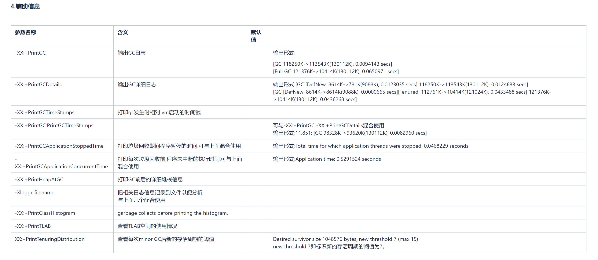

```
-Xms2867m -Xmx2867m  （按不同容器，2G以下建议为60%，2G及以上，建议设置为70%）
-XX:MetaspaceSize=128m
-XX:MaxMetaspaceSize=512m
-Xss256k（栈大小）
-XX:+UseG1GC（使用G1）
-XX:G1HeapRegionSize=n（G1 region的大小，n是2的n次方）
-XX:MaxGCPauseMillis=200（G1最大停顿时间）
-XX:AutoBoxCacheMax=20000
-XX:+HeapDumpOnOutOfMemoryError   （当JVM发生OOM时，自动生成DUMP文件）
-XX:HeapDumpPath=/data/logs/gc/
-XX:ErrorFile=/data/logs/gc/hs_err_%p.log   （当JVM发生崩溃时，自动生成错误日志）
-XX:+PrintGCApplicationStoppedTime
-XX:+PrintGCDetails
-XX:+PrintGCDateStamps
-Xloggc:/data/logs/gc/gc-ePrint-service.log
```

## g1(Garbage First)垃圾回收器
>是一款面向服务器的垃圾收集器,主要针对配备多颗处理器及大容量内存的机器. 以极高概率满足 GC 停顿时间要求的同时,还具备高吞吐量性能特征。其目标是尽可能完全避免full gc，即老年代的STW暂停机制，优先考虑暂停时间、其次才是吞吐量。
````
用了复制和标记整理算法，
对于年轻代，G1采用复制算法。由于年轻代主要存储新创建的对象，其存活率较低，因此G1会将年轻代分为多个区域，每次只回收一部分区域，并将存活的对象复制到新的区域中，这样可以显著减少垃圾回收的停顿时间。对象复制转移会占用较多的内存，容易出现回收失败（Allocation (Evacuation) Failure）。
对于老年代，G1主要采用标记-整理算法。由于老年代存储了大量存活时间较长的对象，因此需要更复杂的算法来处理。G1会遍历所有对象，标记引用情况，清除对象后会对区域进行复制移动，以整合碎片空间。
````

>G1 将 heap 内存区，划分为一个个大小相等（1-32M，2的 n 次方）、内存连续的 Region 区域，每个 region 都对应 Eden、Survivor 、Old、Humongous 四种角色之一,由于 region 与 region 之间并不要求连续，而使用 G1 的场景通常是大内存，比如 64G 甚至更大。
在G1中，有一种特殊的区域，叫Humongous区域简称 H 区。 如果一个对象占用的空间超过了分区容量50%以上，G1收集器就认为这是一个巨型对象。这些巨型对象，默认直接会被分配在老年代。如果old区不够放H，也会进行fullGC来释放空间；且只有 Full GC 阶段，才会回收 H 区，避免了频繁扫描、复制/移动大对象。
>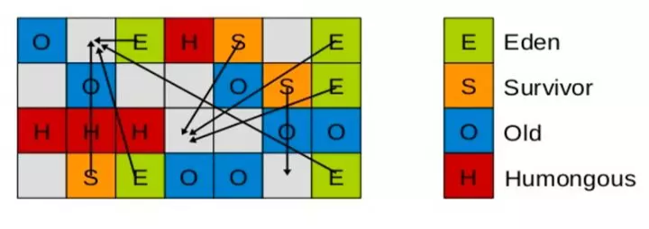
>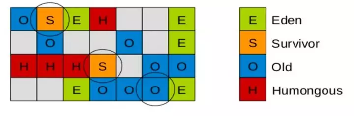

>**G1是物理上不分代，但是逻辑上分代的。**

**Initial Mark(STW) -> Root Region Scan -> Cocurrent Marking -> Remark(STW) -> Copying/Cleanup(STW && Concurrent)**
- 阶段1：存活对象的“初始标记”依赖于 Young GC，GC 日志中会记录成 young 字样
- 阶段2：确定老年代中哪些对象被新生代中的对象引用。
- 阶段3：并发标记过程中，如果发现某些 region 全是空的，会被直接清除
- 阶段4：进入重新标记阶段，处理在并发标记过程中新产生的对象引用关系，以修正这些对象的标记记录。
- 阶段5：筛选回收，并发复制/整理阶段。这个阶段，Young 区和 Old 区的对象有可能会被同时清理。GC 日志中，会记录为 mixed 字段，这也是 G1 的老年代收集，也称为 Mixed GC 的原因。

>通过这几个阶段的分析，虽然看上去很多阶段仍然会发生 STW，但是 G1 提供了一个预测模型，通过统计方法，根据历史数据来预测本次收集，需要选择多少个 Region 来回收，尽量满足用户的预期停顿值（-XX:MaxGCPauseMillis 参数可指定预期停顿值）。
*注：如果 Mixed GC 仍然效果不理想，跟不上新对象分配内存的需求，会使用 Serial Old GC（Full GC）强制收集整个 Heap。*

>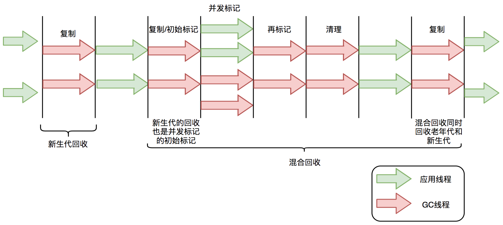
>

>G1收集器的停顿预测模型是以衰减均值（Decaying Average）为理论基础来实现的，在垃圾收集的过程中，G1收集器会记录每个Region的回收耗时、每个Region记忆集里的脏卡数量等各个可测量的步骤花费的成本，并分析得出平均值、标准偏差、置信度等统计信息。

>1.9为默认，与 CMS 相比，G1 有内存整理过程（标记-压缩），避免了内存碎片；STW 时间可控（能预测 GC 停顿时间）。G1相对于CMS，加了一个Region的概念，主要就是为了控制回收时间。所以在回收过程中多了一个Root Region Scan的阶段，就是了选择一些Region回收而不是整代回收。

>G1是确定优先级然后根据优先级来回收，新生代回收(Young GC)-->新生代+并发标记-->混合回收(Mixed GC) 优先回收占用内存大的Region,并发回收还不够内存会进行FullGC。默认45%会进行MixedGC。
它是“选择一些内存块”回收，而不是整代内存来回收，这是G1跟其它GC非常不同的一点，其它GC每次回收都会回收整个Generation的内存(Eden, Old), 而回收内存所需的时间就取决于内存的大小，以及实际垃圾的多少，所以垃圾回收时间是不可控的；而G1每次并不会回收整代内存，到底回收多少内存就看用户配置的暂停时间，配置的时间短就少回收点，配置的时间长就多回收点，伸缩自如。也就是它的可预测回收。
但是也会造成回收速度跟不上新对象分配速度，造成fullGC。

>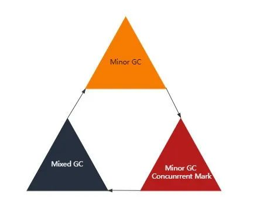

**G1的瓶颈：**
1. 四个STW过程中，初始标记因为只标记GC Roots，耗时较短。再标记因为对象数少，耗时也较短。清理阶段因为内存分区数量少，耗时也较短。转移阶段要处理所有存活的对象，耗时会较长。因此，G1停顿时间的瓶颈主要是标记-复制中的转移阶段STW。主要是G1未能解决转移过程中准确定位对象地址的问题。G1的转移阶段完全STW的，且停顿时间随存活对象的大小增加而增加。
2. 由于设置停顿时间小，所以每次回收并不会回收所有堆内垃圾。这就造成了多次回收才能完成一次回收的任务，所以效率低必然带来整体时间长，影响业务线程的吞吐量。如果这个过程新分配的对象过多，又会造成对象堆积，最后进行fullGC降低性能。

**G1GC的详细过程:**
**G1主要是Young GC、Mixed GC，都是Stop The World(STW)的。**

- Young GC
>Young GC主要是对Eden区进行GC，它在Eden空间耗尽时会被触发。在这种情况下，Eden空间的数据移动到Survivor空间中，如果Survivor空间不够，Eden空间的部分数据会直接晋升到年老代空间。Survivor区的数据移动到新的Survivor区中，也有部分数据年龄大于max threshold晋升到老年代空间中。最终Eden空间的数据为空，GC停止工作，应用线程继续执行。
但是如果回收时间远远小于参数-XX:MaxGCPauseMills设定的值，那么不会触发YoungGC，而是会继续为Eden区增加新的Region区用于存放新分配的对象实例。

- Mixed GC
>当整个堆中年老代的区域占有率达到参数-XX:InitiatingHeapOccupancyPercent设定的值后触发。Mixed GC不仅进行正常的新生代垃圾收集，同时也回收部分后台扫描线程标记的老年代分区，以及大对象Humongous区。
它的GC步骤分2步： 
全局并发标记（global concurrent marking）;
拷贝存活对象（evacuation）：拷贝过程中，如果发现没有足够多的空闲Region承载拷贝对象，此时就会触发一次Full GC。
在进行Mix GC之前，会先进行global concurrent marking（全局并发标记）。 在G1 GC中，它主要是为Mixed GC提供标记服务的，并不是一次GC过程的一个必须环节。
````
global concurrent marking的执行过程分为五个步骤：
1. 初始标记（initial mark，STW）在此阶段，G1 GC 对根对象GCRoots进行标记。并修改TAMS指针的值，该阶段与常规的 (STW) 年轻代垃圾回收密切相关。
2. 根区域扫描（root region scan）G1 GC 在初始标记的存活区扫描对老年代的引用，并标记被引用的对象。该阶段与应用程序（非 STW）同时运行，并且只有完成该阶段后，才能开始下一次 STW 年轻代垃圾回收。通过根区域扫描，可以确定老年代中哪些对象被新生代中的对象引用，从而在进行年轻代垃圾回收时，能够准确地识别出需要保留的对象。
3. 并发标记（Concurrent Marking）G1 GC 在整个堆中查找可访问的（存活的）对象。该阶段与应用程序同时运行，可以被 STW 年轻代垃圾回收中断。使用SATB解决漏标问题，更新引用变动的对象。
4. 最终标记（Remark，STW）该阶段是 短暂的STW 回收，帮助完成标记周期。G1 GC 更新并清空 SATB（Snapshot-At-The-Beginning）缓冲区，跟踪未被访问的存活对象，并执行更新引用处理，防止错标，误标，漏标。更新记录跨区域的引用关系，为下一次垃圾收集做准备。
5. 清除垃圾（Cleanup，STW）在这个最后阶段，G1 GC 执行统计和 RSet 净化的 STW 操作。在统计期间，G1 GC 会识别完全空闲的区域和可供进行混合垃圾回收的区域，筛选价值大的region进行优先回收。清理阶段在将空白区域重置并返回到空闲列表时为部分并发。
````
````
拷贝过程中，如果发现没有足够多的空闲Region承载拷贝对象，此时就会触发一次Full GC：
G1首先会停止系统所有用户线程，然后采用单线程进行标记、清理和压缩整理内存，以便于清理出足够多的空闲Region来供下一次MixedGC使用。G1本身没有FullGC设定，FullGC是采用Serial old（单线程老年代GC） FullGC。
因为G1在设计时的初衷就是要避免发生FullGC，如果上述两种GC发生后还是无法使得程序恢复正常执行，最终就会触发SerialOld收集器的FullGC。
````

>Young GC：选定所有新生代里的region。通过控制新生代的region个数来控制young GC的开销。

>Mixed GC：选定所有新生代里的region，外加根据global concurrent marking统计得出收集收益高的若干老年代region。在用户指定的开销目标范围内尽可能选择收益高的老年代region。

>JVM中会维护一个卡表（Card Table）的数据结构，主要用于查看老年代中指向新生代中的对象，标记脏卡，执行新生代的rememberedSet。cardTable 512k。Card Table则是一种points-out（我引用了谁的对象）的结构，G1 中每个 Region 需要借助额外的 RSets 来记录“谁引用了我”，占用了额外的内存空间，每次对象移动时，RSets 也需要更新，会产生开销。

>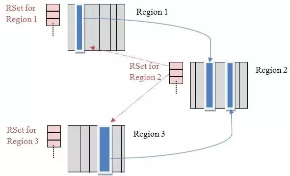

````
为了提高扫描根对象和标记的效率，G1 使用了二个新的辅助存储结构：
Remembered Sets：简称 RSets（记忆集），用于根据每个 region 里的对象，是从哪指向过来的，属于points-into结构（即谁引用了我），每个 Region 都有独立的 RSets（Other Region -> Self Region）。RSets 的引入，在 YGC 时，将年青代 Region 的 RSets 做为根对象，可以避免扫描老年代的 region，能大大减轻 GC 的负担。在老年代收集 Mixed GC 时，RSets 记录了 Old->Old 的引用，也可以避免扫描所有 Old 区。
G1需要通过写屏障来维护记忆集，才能处理跨代指针，得以实现Region的增量回收。RSets其实是一个Hash Table，Key是别的Region的起始地址，Value是一个集合，里面的元素是Card Table的Index。“Concurrent refinement threads”即并发细化线程作用就是扫描脏卡队列中的卡片，然后更新相关区域的记忆集。Rsets主要就是在进行垃圾回收时，可以避免对整个堆进行扫描，从而提高垃圾回收的效率。

Collection Sets ：简称 CSets，记录了等待回收的 Region 集合，GC 时这些 Region 中的对象会被回收（copied or moved）。
````
````
SATB（Snapshot-At-The-Beginning） 算法是为了应对两种情况下的漏标，是G1收集器解决并发标记阶段对象消失问题的算法。
1.解决新创建对象产生的漏标问题：在 GC 开始时先创建一个对象快照，在并发标记时，所有快照中当时的存活对象就认为是存活的，标记过程中新分配的对象也会被标记为存活对象，不会被回收。其核心的两个结构是两个 bitmap（位图），分别存储在每个 region 中。
通过控制两个变量 pre_tams（代表着 region 上一次完成标记的位置）以及 next_tams（随着标记的进行会不断移动，一开始在 top 位置）的移动来进行标记。假设第 n 轮并发标记开始，将该 region 当前的 top 指针赋值给 next_tams，在并发标记期间，分配的对象都在(next_tams, top)之间，SATB 能够确保这部分的对象都会被标记，默认都是存活的。
当并发标记结束时，将 next_tams 所在的地址赋值给 previoustams，SATB 给(bottom, previoustams)之间的对象创建一个快照 bitmap，所有垃圾对象能通过快照被识别出来。第 n+1 轮并发标记开始，过程和第 n 轮一样。
2.解决对象引用被修改产生的漏标问题：SATB 利用 pre-write barrier（写前屏障），将所有即将被修改引用关系的白对象旧引用记录下来，最后以这些旧引用为根重新扫描一遍，以解决白对象引用被修改产生的漏标问题。在引用修改时把原引用保存到 satb_mark_queue 中（每个线程都自带一个 satb_mark_queue），在下一次的并发标记阶段，会依次处理 satb_mark_queue 中的对象，确保这部分对象在本轮 GC 中是存活的。
如果被修改引用的白对象就是要被收集的垃圾，这次的标记会让它躲过 GC，这就是浮动垃圾（float garbage），因为 SATB 的做法精度比较低，所以造成的浮动垃圾也会比较多。
````

>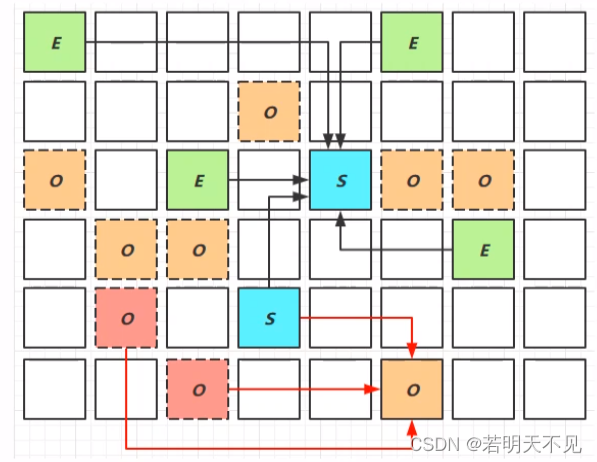</br>
>图中有三个Region，每个Region被分成了多个Card，在不同Region中的Card会相互引用，Region1中的Card中的对象引用了Region2中的Card中的对象，蓝色实线表示的就是points-out的关系，而在Region2的RSet中，记录了Region1的Card，即红色虚线表示的关系，这就是points-into。

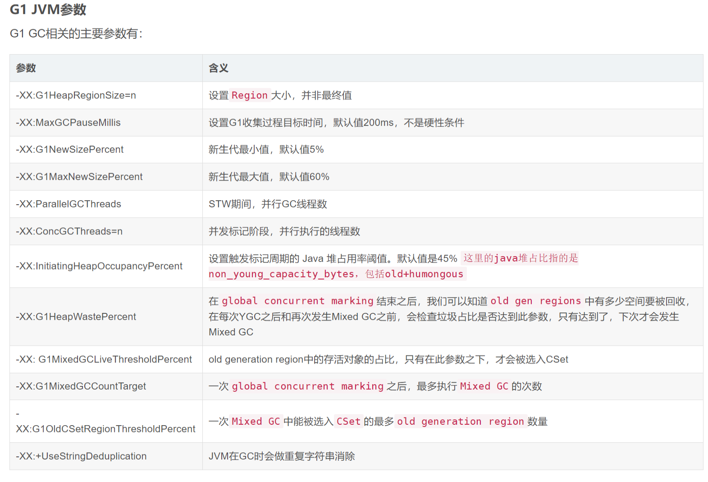

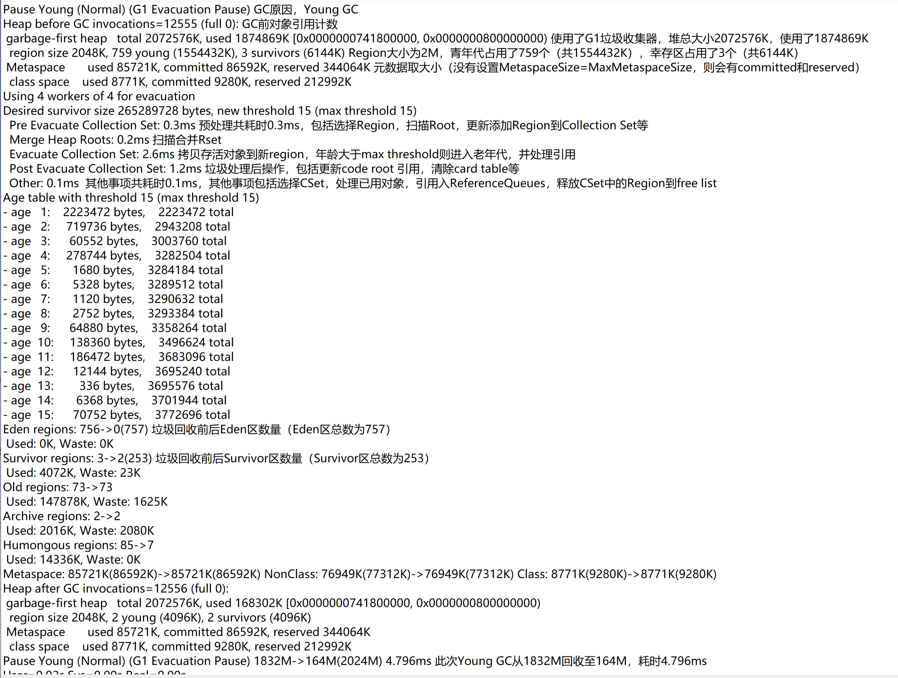

## ZGC，Z ? just a name
>ZGC采用标记-复制算法，ZGC在标记、转移和重定位阶段几乎都是并发的，这是ZGC实现停顿时间小于10ms目标的最关键原因。

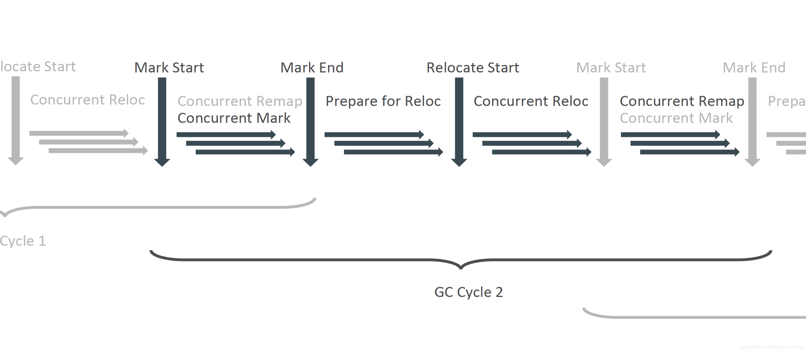

1. 阶段1：初始标记（Mark Start）  STW  需要扫描所有GC Roots
这个阶段是 Stop-The-World (STW) 的，意味着会暂停应用程序的线程。在这个阶段，ZGC 会快速识别并标记所有从 GC Roots 直接可达的对象。初始标记只会存活的根对象被标记为M0 (M1) ，M0还是M1根据前一周期交替设置的，并被加入标记栈进行并发标记。与G1不同的是，ZGC的标记是在指针上而不是在对象上进行的。
2. 阶段2：并发标记/对象重定位（Concurrent Mark and Remapping）
这个阶段是并发的，ZGC 会在这个阶段遍历对象图，标记存活的对象，同时进行region的活跃度，选择需要回收的region，进行对象的整理重定位的准备工作（就是将Remapped调整为M0或M1），同时也是会将之前转移的对象进行重新映射。这里会使用到读屏障进行标记动作（分代改为了写屏障）。还是一个CAS的操作，是线程安全的。
3. 阶段3：重新标记 （Remark） STW
这是一个STW阶段，用于处理在并发标记阶段由于应用程序的活动而产生的变化。这个阶段通常比初始标记短，因为它只需要处理在并发标记阶段遗漏的新对象。
4. 阶段4：并发转移准备（Concurrent Prepare for Relocate）
在这个阶段，ZGC 会重置一部分数据结构，为即将到来的内存转移做准备。处理弱引用，清理不使用的对象，选择可以回收的region，并筛选组成重分配relocation set（转移集合）。
5. 阶段5：初始转移（Relocate Start）  STW  需要扫描所有GC Roots
这个阶段是 STW 的，ZGC 会处理那些在并发标记阶段无法处理的对象转移，将地址视图从M0或者M1调整为Remapped，说明进入真正的转移。此后所有重分配的对象视图都是Remapped。遍历GC Roots对象的直接引用的对象，对这些对象进行转移。
6. 阶段6：并发转移（Concurrent Relocate）
在这个阶段，ZGC 会并发地移动存活对象（包括relocation set中的存活对象）到新的内存位置，以便于整理内存和回收空间。新地址在转发表中，每个Region维护一个转发表（Forward Table，推外内存），记录从旧对象到新对象的转向关系。转移完成的region会被回收。转发表会在对象重定位调整后删除。
ZGC收集器能仅从引用上就明确得知一个对象是否处于重分配集之中，如果用户线程此时并发访问了位于重分配集中的对象，这次访问将会被预置的内存屏障（读屏障）所截获，可以根据Region上的转发表记录将访问转发到新复制的对象上（使用了快慢路径），并同时修正更新该引用的值，使其直接指向新对象，ZGC将这种行为称为指针的“自愈”（Self-Healing）能力。
因为“自愈”（Self-Healing）能力，所以只有第一次访问旧对象会变慢，但是后面重新指向后就还是原来的效率。
一旦重分配集中某个Region的存活对象都复制完毕后，这个Region就可以立即释放用于新对象的分配，但是转发表还得留着不能释放掉，因为可能还有访问在使用这个转发表。
7. 阶段7也是阶段2：并发重映射（Concurrent Remap）
重映射所做的就是修正整个堆中指向重分配集中旧对象的所有引用，但是ZGC中对象引用存在“自愈”功能，所以这个重映射操作并不是很迫切。ZGC很巧妙地把并发重映射阶段要做的工作，合并到了下一次垃圾收集循环中的并发标记阶段里去完成，反正它们都是要遍历所有对象的，这样合并就节省了一次遍历对象图的开销。一旦所有指针都被修正之后，原来记录新旧对象关系的转发表就可以释放掉了。

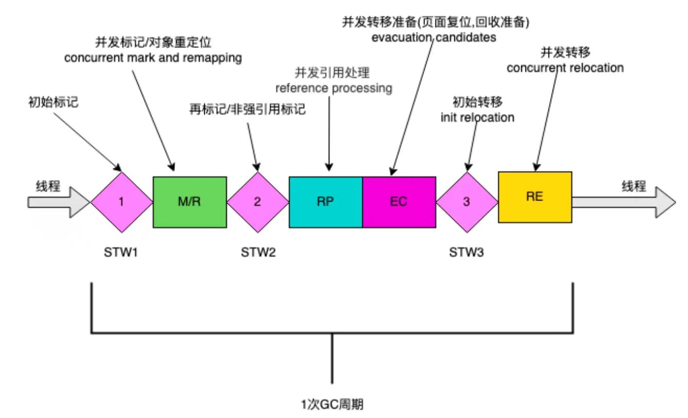
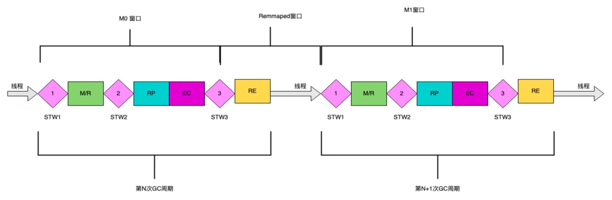


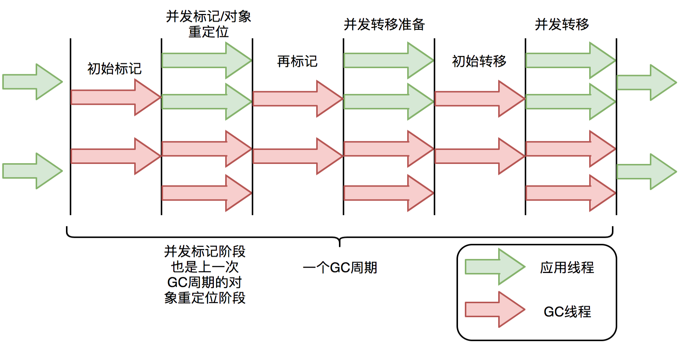

````
ZGC几乎所有暂停都只依赖于GC Roots集合大小，停顿时间不会随着堆的大小或者活跃对象的大小而增加。所以说时间复杂度是O(1)，因为GCRoots大小是初始化时就确定的，所以停顿时间也是确定的。
````

**优化：**
1. 动态调整大小的 Region
2. 不分代，干掉了 RSets
3. 带颜色的指针 Colored Pointer
4. 加载屏障 Load Barrier（读屏障）
5. 重定位 Relocation
6. 多重映射 Multi-Mapping
7. 支持 NUMA 架构,非一致内存访问的缩写 （Non-Uniform Memory Access，NUMA）

>每次 GC 总体卡顿时间按官方说法<10ms，启用 zgc，需要设置 -XX:+UnlockExperimentalVMOptions -XX:+UseZGC
ZGC默认是使用1/4(向上取整)核数，至少为1。关闭-XX:ConcGCthreads 是1/8(向上取整)

**ZGC 中的几种触发 GC场景：**
- 定时触发：默认为不使用，可以通过 ZCollectionInterval 参数配置。GC 日志中的关键字 “Timer”。
- 预热触发：最多三次，在堆内存空间达到 10%、20%、30% 时机触发、主要是通过 GC 的时间、为其他的 GC 触发准备。GC日志关键字 “Warmup”。
- 分配速率：基于正态分布统计，计算内存 99% 可能的最大分配速率，以及此速率下内存将要耗尽的时间点，在耗尽之前触发 GC （耗尽时间，一次 GC 最大持续时间-一次 GC 检测周期时间）。GC日志关键字 “Allocation Rate”。
- 主动触发：（默认开启，可以通过 ZProactictive 参数配置）距上一次 GC 堆内存增长 10%，超过 5 分钟时，对比上次 GC的间隔时间限（一次 GC 最大持续时间），超过则触发。GC 日志关键字 “Proactive”。
- 元数据分配触发：元数据区不足导致，GC 日志关键中是 “Metadata GC Threshold”
- 直接触发：代码中显示调用 System.gc() 触发，GC 日志关键字是 “System.gc()”。
- 阻塞内存分配请求触发：垃圾对象来不及挥手，占满整个堆空间，导致部分线程阻塞，GC 日志关键字是 “Allocation Stall”。

**缺点：**
- 吞吐量下降。由于非分代ZGC是单代回收，需要处理的对象更多，且使用读屏障。都更加消耗CPU资源。
- CPU核数必须多。由于ZGC全程并发的特性，必然要求更多的CPU资源来支撑。
- 浮动垃圾。因为低停顿，ZGC不会全部执行完成，而是根据需要部分回收，所以在大量创建对象过程中，会导致大量对象无法在本次回收，必须等到下一次，这就是浮动垃圾。
- 很多“朝生夕死”的对象没能及时的被回收，占用空间。

*所以还是要分代回收的，jdk17中是非分代ZGC，jdk21中是分代ZGC。*

**具体技术：**
1. 动态调整大小的 Region
创建和销毁 Region，可以动态调整大小，内存使用更高效。
   - `小型Region（Small Region）`：容量固定为2MB，用于放置小于256KB的小对象。 
   - `中型Region（Medium Region）`：容量固定为32MB，用于放置大于等于256KB但小于4MB的对象。 
   - `大型Region（Large Region）`：容量不固定，可以动态变化，但必须为2MB的整数倍，用于放置4MB或以上的大对象。每个大型Region中只会存放一个大对象，这也预示着虽然名字叫作「大型Region」，但它的实际容量完全有可能小于中型Region，最小容量可低至4MB。大型Region在ZGC的实现中是不会被重分配的，因为复制一个大对象的代价非常高昂。

>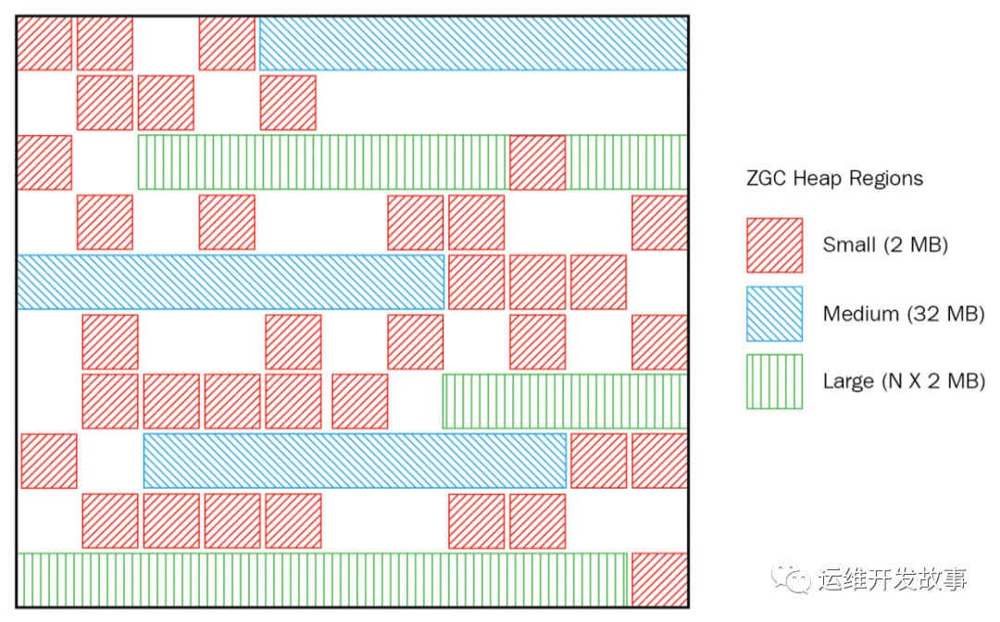

2. 不分代，干掉了 RSets
>ZGC 没有实现分代机制，每次都是并发的对所有 region 进行回收，不像G1是增量回收，所以用不着 RSets。不分代带来的性能下降，会用下面马上提到的 Colored Pointer && Load Barrier 来优化。

3. 带颜色的指针 Colored Pointer
>指针类似 Java 中的引用，意为对某块虚拟内存的引用。ZGC 采用了64位指针（注：目前只支持 linux 64 位系统），将 42-45 这 4 个 bit 位置赋予了不同含义，即所谓的颜色标志位，也换为指针的 metadata，就是把标记存在指针元数据中。通过指针的标记就可以知道对象是否引用，可以判断是否存活，不需要关心引用对象本身。
````
18位：预留给以后使用；
1位：Finalizable标识，此位与并发引用处理有关，它表示这个对象只能通过finalizer才能访问，未来会被移除；
1位：Remapped标识，表示对象是否已经完成重定位，对象指向relocation set中（relocation set表示需要GC清理的Region集合），在并发重分配时发生转移后标记为remapped，并生成转发表，在下一次并发标记时更新标记；
1位：Marked1标识；
1位：Marked0标识，和上面的Marked1都是标记对象用于辅助GC，用于标志可达对象。为什么会有M0、M1两个标识呢？这是因为需要用来区分本次GC标记和上次GC标记；
这 4 个标志位，同一时刻只会有 1 个位置是 1。每当指针对应的内存数据发生变化，比如内存被移动，颜色会发生变化。这样染色指针已经知道哪些对象需要回收移动。不需要其他GC还需要复制分配后再回收。
42位：对象的地址（所以它可以支持2^42=4T内存），后来扩展为44位（16T）；
````
>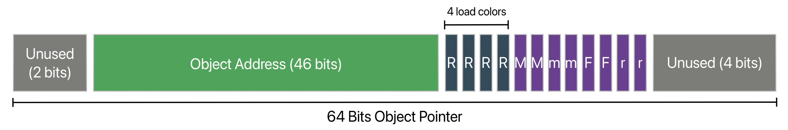
>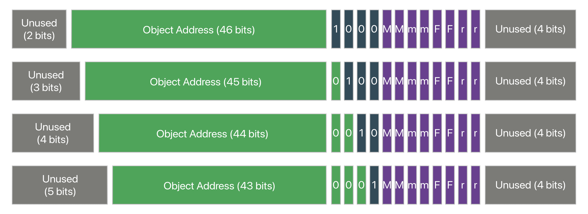

>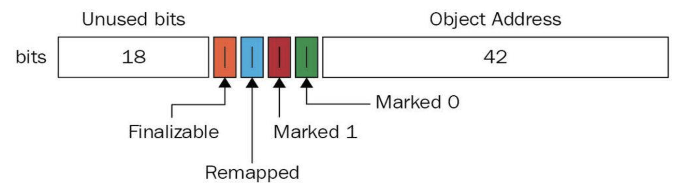

4. 加载屏障 Load Barrier（读屏障）
>传统 GC 做标记时，为了防止其他线程在标记期间修改对象，通常会简单的 STW。而 ZGC 有了 Colored Pointer 后，引入了所谓的“加载屏障”，是JIT注入到类文件的代码段的技术（类似于AOP做的增强）：
````
Object o = obj.FieldA   // 从堆中读取引用，需要加入屏障
<Load barrier>
Object p = o  // 无需加入屏障，因为不是从堆中读取引用
o.dosomething() // 无需加入屏障，因为不是从堆中读取引用
int i =  obj.FieldB  //无需加入屏障，因为不是对象引用
````

>当指针引用的内存正被移动时也就是应用程序读取对象中指向另一个对象的字段，指针上的颜色就会变化，ZGC 会先把指针更新成最新状态，然后再返回（你可以回想下 Java 中的 volatile 关键字，有异曲同工之妙）。这样仅读取该指针时，可能会略有开销，而不用将整个 heap STW。但是仅“从堆中读取对象引用”才会触发加载屏障。
读屏障根据Region上的转发表记录将访问转发到新复制的对象上（使用了快慢路径），并同时修正更新该引用的值，使其直接指向新对象，ZGC将这种行为称为指针的“自愈”（Self-Healing）能力。因为“自愈”（Self-Healing）能力，所以只有第一次访问旧对象会变慢（需要走慢路径），但是后面重新指向后更快效率（修复后走快路径）。
一旦重分配集中某个Region的存活对象都复制完毕后，这个Region就可以立即释放用于新对象的分配，但是转发表还得留着不能释放掉，因为可能还有访问在使用这个转发表。

>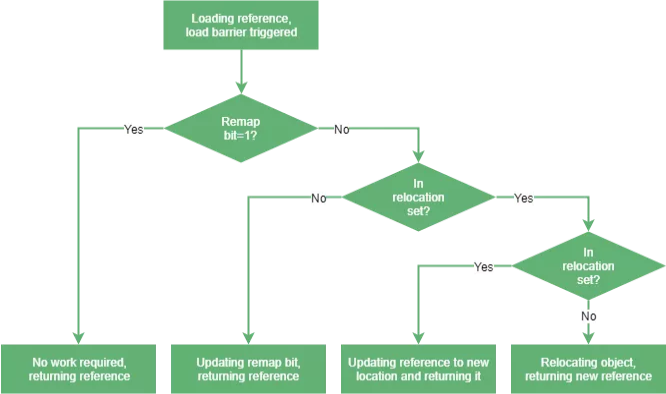

5. 重定位 Relocation
>使用加载屏障在应用程序读取对象时，如果对象移动过，那么加载屏障会把读出来的指针更新到对象的新地址上，这样应用线程始终访问的都是对象的新地址。

6. 多重映射 Multi-Mapping
>多映射内存可用于在不改变指针所指向的对象的情况下向指针添加元数据位。ZGC 使用它来实现对其染色指针的透明支持。
因为不能随意更改内存中指针的含义，所以使用mmap将同一块儿物理内存映射为 Marked0、Marked1 和 Remapped 三个虚拟内存。当应用程序创建对象时，ZGC 会为这个对象在这三个视图空间分别申请一个虚拟地址，而这三个虚拟地址都映射到同一个物理地址。这三个虚拟内存可作为 ZGC 的三个视图空间，在同一时间点内只有一个是有效的。ZGC 通过这三个视图空间的切换，来完成并发的垃圾回收等操作，从而提高了内存管理的效率和灵活性。
这种方式使得在进行某些操作时，例如垃圾回收，无需移动实际的物理内存中的数据，只需切换虚拟内存的映射关系，降低了内存管理的开销，并减少了对程序运行的影响。同时，通过这种多视图的方式，可以更方便地进行一些内存管理和优化策略。
但是元数据较多将导致虚拟地址空间的浪费，并且可能会用尽64位地址空间。此外，使用多重映射内存还会增加地址转换的开销，降低垃圾回收的效率。

7. 支持 NUMA 架构,非一致内存访问的缩写 （Non-Uniform Memory Access，NUMA）
>NUMA 是一种多核服务器的架构，申请堆内存时，判断当前线程属是哪个CPU在执行，然后就近申请该 CPU 能使用的本地内存。GC回收时，则可以优先处理当前使用的内存，减少跨节点访问，提升效率。
>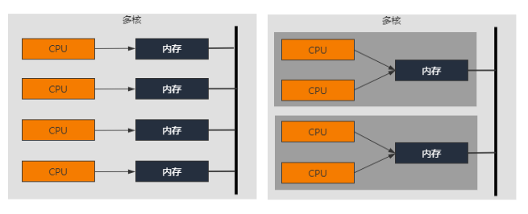

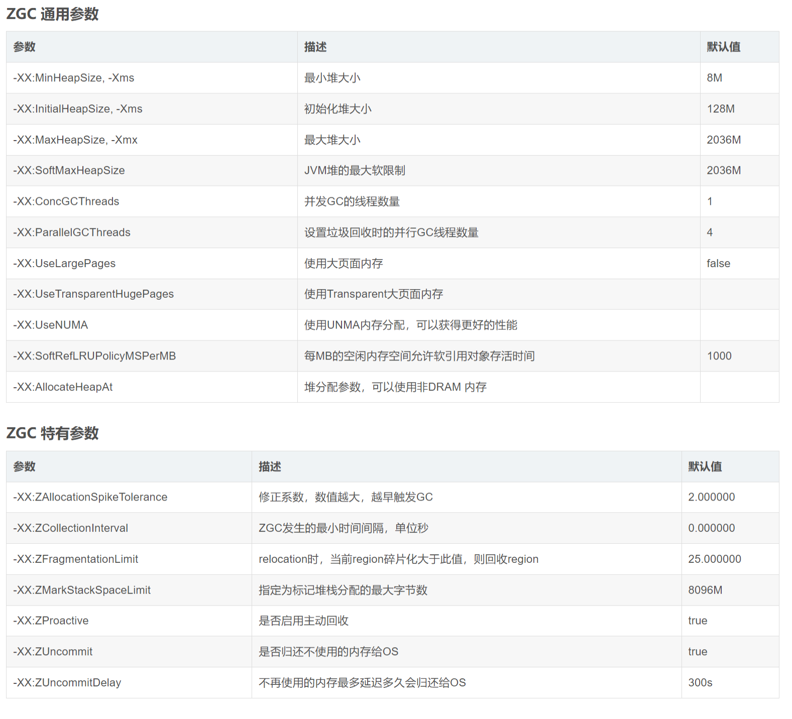

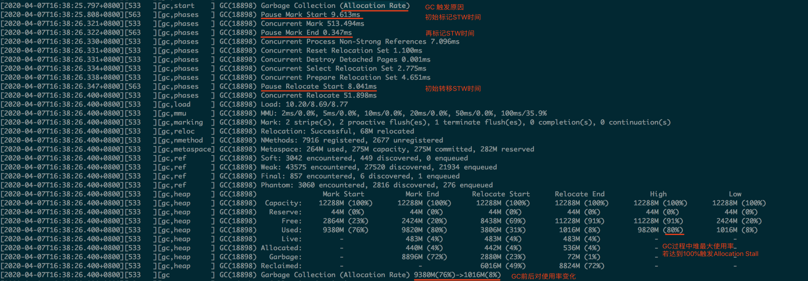

## 分代ZGC

>由于 ZGC 与应用程序同时读取和修改对象图，因此必须注意为应用程序提供一致的对象图视图。ZGC 通过彩色指针、加载障碍和存储障碍来做到这一点。
当然分代了必然要使用空间来存代际指针，不过ZGC用的BitMap做双缓冲记忆集的方式来降低存储并提高效率。
分代ZGC实现并发运行两个垃圾收集器，年轻代和老年代同时运行，年轻代频繁而老年代较少。
即使分代，ZGC依然需要更大的内存空间和更多CPU来处理GC，因为全程并发低停顿，导致GC过程中依然会有大量对象创建，就需要足够空间来分配。

>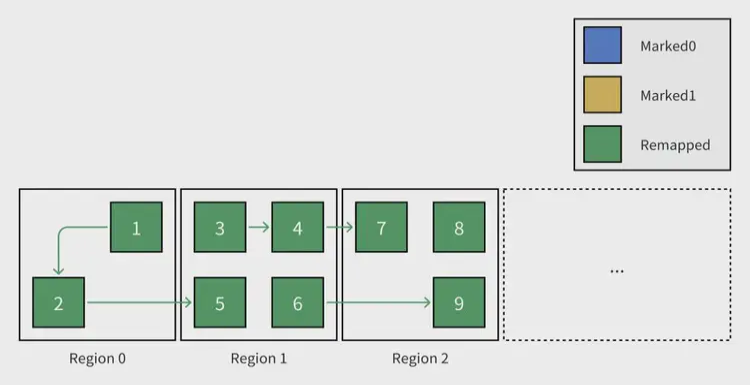
>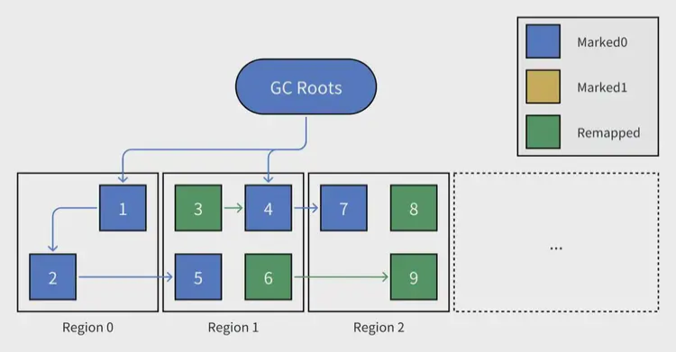
>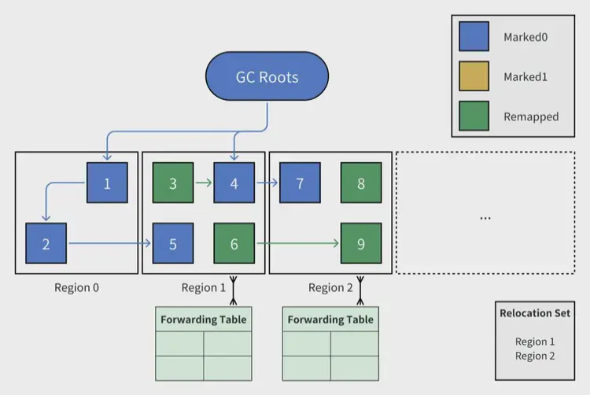
>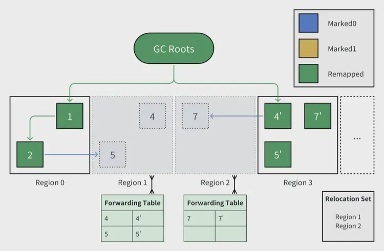
>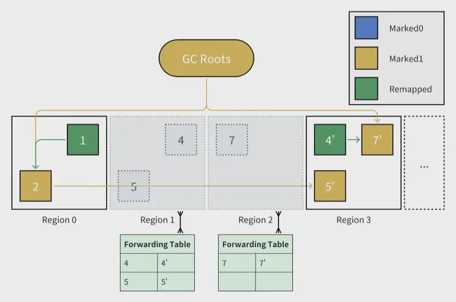
>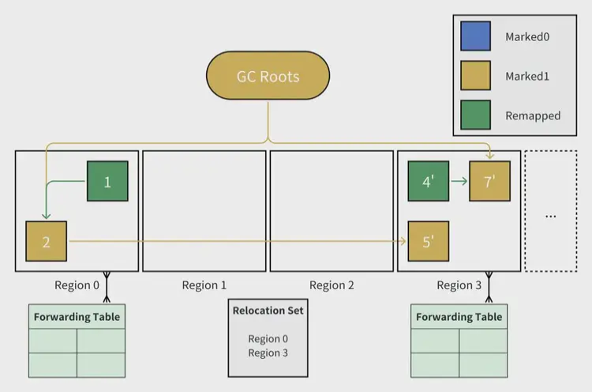

**优化：**
1. 存储屏障（store barrier-写屏障）：
>是 ZGC 注入应用程序的代码片段，只要应用程序将引用存储到对象字段中，就会使用存储屏障。ZGC 为彩色指针添加了新的元数据位，这样存储屏障就能确定正在写入的字段是否已被记录为可能包含跨代指针。彩色指针使ZGC 的存储屏障比传统的存储屏障更高效。增加存储屏障后，ZGC 可以将标记可达对象的工作从加载屏障转移到存储屏障。
也就是说，存储屏障可以使用彩色指针中的元数据位来有效地确定在存储之前字段所引用的对象是否需要标记。而且加载屏障（读屏障）比存储屏障（写屏障）使用频率更高，这样更能提升性能。读写分离嘛。

2. 无多重映射内存（No multi-mapped memory）：
>放弃多重映射内存造成的虚拟内存浪费，转而在加载（读）和存储（写）屏障中使用显式代码在有色和无色指针之间转换来管理内存处理。存储在对象字段中的对象引用被实现为染色指针，存储在 JVM 堆栈中的对象引用在硬件堆栈或 CPU 寄存器中实现为无色指针，没有元数据位。读屏障和存储屏障控制染色指针和无色指针之间的转换。
由于染色指针永远不会出现在硬件堆栈或 CPU 寄存器中，因此只要可以有效地完成染色指针和无色指针之间的转换，就可以使用更奇特的染色指针布局。

3. 优化屏障（Optimized barriers）：
>由于分代 ZGC 的元数据比较多，使用多重映射内存的方法不再能行得通。因此，在寄存器和栈中的内存地址需要为普通的无色指针。分代 ZGC 不再能通过此减少加载或存储内存屏障的开销，需要在有色和无色指针之间转换，即：
加载屏障: 在加载（读）时移除元数据
存储屏障: 在存储（写）时恢复元数据
````
用于优化屏障的一些技术包括：
1.快速路径和慢速路径（Fast paths and slow paths）：快路径检测是否需要额外的 GC 工作，当需要时，会跳转进入慢路径，开始相关工作。快路径由 JIT 实现，会直接插入 GC 代码至 JIT 编译后的程序。而慢路径不经常调用，所以使用 C++ 实现。当对象移动后，读屏障会在快路径中返回空，则使用慢速路径，慢路径包含计算有效状态指针的逻辑：检查对象是否已经（或即将）重新定位，如果是，则查找或生成新的地址。
2.最小化负载屏障责任（Minimizing load barrier responsibilities）：其实也就是读写职责分离，将标记职责给了存储屏障（写）。在分代 ZGC 中，加载屏障负责：转换有色指针为无色指针，更新已被 GC 更新的过时指针；存储屏障负责：转换无色指针为有色指针，维护记忆集，标记对象存活。
3.记忆集屏障（Remembered-set barriers）
4.SATB 标记屏障（SATB marking barriers）
5.融合存储屏障检查（Fused store barrier checks）
6.存储屏障缓冲区（Store barrier buffers）：为了快慢路径做缓冲，减少慢路径开销的。
7.屏障修补（Barrier patching）
````

4. 双缓冲记忆集（Double-buffered remembered sets）：
>许多 GC 使用一种称为卡表标记的记忆集技术来跟踪代际指针。当应用线程写入对象字段时，也会写入（即弄脏）一个称为卡表的大型字节数组中的一个字节。通常，表中的一个字节对应堆中 512 字节的地址范围。要找到所有从老一代到年轻一代的对象指针，GC 必须找到并访问地址范围内的所有对象字段，这些地址范围与卡表中的脏字节相对应。
相比之下，分代 ZGC 使用位图(bitMap:二进制set结构)精确记录对象字段位置，位图中的每个位都代表一个潜在的对象字段地址。每个老年代区域都有一对记忆设置位图。其中一个位图处于活动状态，由运行存储（写）屏障的应用程序线程填充，而另一个位图则被 GC 用作所有记录的老年代对象字段的只读副本，这些字段可能指向年轻代中的对象。每次启动YoungGC时，这两个位图都会原子交换。
这种方法的一个好处是，应用程序线程无需等待位图被清除。在应用线程同时填充另一个位图时，GC 会处理并清除其中一个位图。这样做的另一个好处是，由于应用程序线程和 GC 线程可以在不同的位图上工作，因此无需在两类线程之间设置额外的内存屏障。其他使用卡片表标记的分代收集器（如 G1）在标记卡片时需要内存栅栏，从而可能导致存储障碍性能下降。

5. 无追加堆内存重定位（Relocations without additional heap memory）:
>其他 HotSpot GC 中的年轻代回收使用清理模型，GC 一次性找到存活对象并重分配。在 GC 完全了解哪些对象还活着之前，年轻代中的所有对象都必须重分配，在这之后才能回收内存。因此，这些 GC 需要猜测存活对象所需的内存量，并确保在 GC 启动时该内存量可用。如果猜错了，则需要更昂贵的清理操作：例如，就地固定未重分配的对象，这会导致内存碎片，或者 Full GC。也就是其他GC需要预留空间判断是否会不会超了。
````
分代 ZGC 有两个阶段：
1.访问并标记所有可达对象
2.重分配标记的对象
由于 GC 在重分配之前就知道对象是否存活，因此可以按区域粒度划分工作。一旦存活对象都被重分配出某个区域，即该区域已被清除，该区域就被当作新的目标区域，继续用于重分配或被应用使用。即使没有额外的堆空间，ZGC 仍可通过将压缩对象到当前区域来继续重分配。这使得分代 ZGC 能够重分配并压缩年轻代，而无需使用额外的堆内存。也就不用额外预留空间，现在的都能使用，使用率更高，碎片化几率小。迁移分为就地迁移和异地迁移。
````
6. 密集堆区域（Dense heap regions）：
>年轻代region如果移动到老年的成本太高，则可以根据存活对象中年轻代的密度来判断是否可以直接就地老化为老年region，从而降低移动对象带来的性能消耗。

7. 完整垃圾收集（Full garbage collections）：
>就是在先进行yongGC再进行mixedGC。因为有些年轻代中的弱引用是希望下次GC被回收的，如果直接收老年代会导致年轻代的这些对象还没有回收会有引用关系导致不回收这个老年对象。为了避免这种情况，所以可以先进行yongGC。

8. 灵活处理大对象（Large objects）：
>分代ZGC允许将大型对象分配给年轻代，如果它们存活时间短，则在年轻代中收集；如果存活时间长，则提升到老年代。

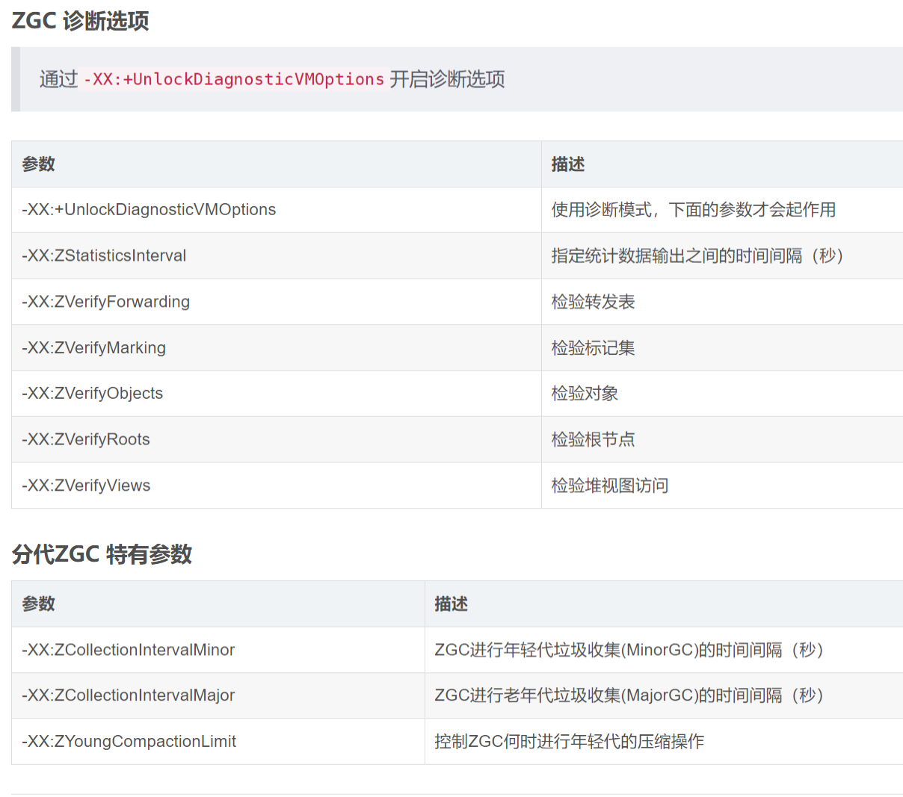

## Shenandoah收集器
>Shenandoah 和 G1 有相似的堆内存布局，在初始标记、并发标记等许多阶段的处理思路都高度一致，甚至直接共享一部分代码。不同的是，虽然 Shenandoah 也是基于 Region 的堆内存布局，回收策略也和 G1 一致，但在管理堆内存方面，它与 G1 至少有三个明显的不同：

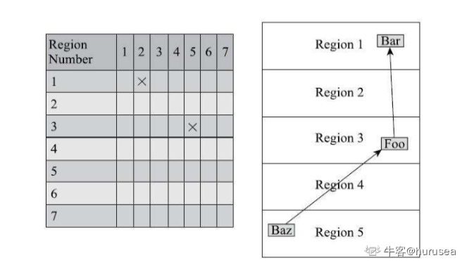

>支持并发整理算法，G1 的回收阶段可以多线程并行，但不能与用户线程并发 Shenandoah 默认不使用分代收集
Shenandoah 摒弃了在 G1 中需耗费大量资源去维护的记忆集，改用连接矩阵的全局数据结构来记录跨 Region 的引用关系

**Shenandoah 收集器的工作过程大致可分为以下九个阶段：**
1. 初始标记
首先标记与 GC Roots 直接关联的对象，需要 Stop The World，停顿时间与堆大小无关，只与GC Roots的数量相关。
2. 并发标记
遍历对象图，标记出全部可达对象，这个阶段与用户线程一起并发执行，时间长短取决于堆中存活对象的数量以及对象图的结构复杂程度。
3. 最终标记
处理剩余的 SATB 扫描，并统计出回收价值最高的 Region，并构成一组回收集（Collection Set），该阶段会有短暂停顿。
4. 并发清理
这个阶段用于清理那些整个区域内连一个存活对象都没有找到的 Region（这类Region被称为Immediate Garbage Region）。
5. 并发回收
把回收集里面的存活对象先复制一份到其他未被使用的 Region，并发执行的困难在于移动对象的同时，用户线程可能会对移动对象进行读写访问，移动对象是一次性行为，但移动之后整个内存中所有指向对象的引用还是旧对象的地址，还难在一瞬间全部改变过来。Shenandoah 将会通过读屏障和被称为 Brooks Pointers 的转发指针来解决。并发回收阶段运行的时间长短取决于回收集的大小。
6. 初始引用更新
并发回收复制对象结束后，还需把堆中所有指向旧对象的引用修正到复制后的新对象，这个操作称为引用更新。引用更新的初始化阶段实际上并没有做什么具体处理，只是为了建立一个线程集合点，确保所有并发回收阶段中进行的收集器线程都已经完成分配给它们的对象移动任务，会有短暂的停顿。
7. 并发引用更新
真正开始引用更新操作，与并发标记不同，它不再需要沿着对象图来搜索，只需按照内存物理地址的顺序，线性地搜索出引用类型，把旧值改为新值。这个阶段是与用户线程一起并发的，时间长短取决于内存中涉及的引用数量的多少。
8. 最终引用更新
修正 GC Roots 中的引用，这个阶段是 Shenandoah 的最后一次停顿，停顿时间只与GC Roots的数量相关。
9. 并发清理
经过并发回收和引用更新后，整个回收集中所有的 Region 已无存活对象，这些Region都变成Immediate Garbage Regions了，最后一次并发清理回收这些 Region 的内存空间，供新对象分配使用

>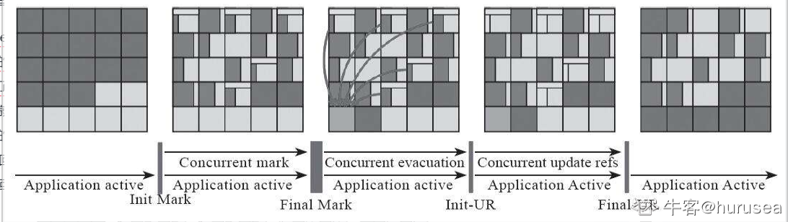

>Shenandoah 用于支持并发整理的核心概念 —— 转发指针（Brooks Pointer）。此前，要做类似的并发操作，通常要在被移动对象原有的内存上设置保护指针，一旦用户程序访问到归属于旧对象的内存空间就会产生自陷中断，进入预设好的异常处理器，再由其中的代码逻辑把访问转发到复制后的新对象。这种方式虽然能实现对象移动和用户线程并发，但如果没有操作系统层面的直接支持，将导致用户态频繁切换到核心态，代价巨大
转发指针是在原有对象布局结构的最前面统一增加一个新的引用字段，在正常情况下，该引用指向对象自己。当对象拥有一份新的副本时，只需修改一处指针的值，即旧对象上转发指针的引用位置，使其指向新对象，便可将所有对该对象的访问转发到新的副本上。这样只要旧对象的内存仍然存在，虚拟机内存中所有通过旧地址访问的代码仍可继续使用，都会被转发到新对象继续工作。由于没有ZGC的自愈能力，导致每次都要转发，对于移动的对象每次都慢。

>连接矩阵可以简单理解为一张二维表格，如果Region N有对象指向Region M，就在表格的N行M列中打上一个标记，如果Region 5中的对象Baz引用了Region 3的Foo，Foo又引用了Region 1的Bar，那连接矩阵中的5行3列、3行1列就应该被打上标记。在回收时通过这张表格就可以得出哪些Region之间产生了跨代引用。

>其中三个最重要的并发阶段（并发标记、并发回收、并发引用更新），就能比较容易理清Shenandoah是如何运作的了。黄色的区域代表的是被选入回收集的Region，绿色部分就代表还存活的对象，蓝色就是用户线程可以用来分配对象的内存Region了。
不仅展示了Shenandoah三个并发阶段的工作过程，还能形象地表示出并发标记阶段如何找出回收对象确定回收集，并发回收阶段如何移动回收集中的存活对象，并发引用更新阶段如何将指向回收集中存活对象的所有引用全部修正，此后回收集便不存在任何引用可达的存活对象了。

>Shenandoah停顿时间比其他几款收集器确实有了质的飞跃，但也并未实现最大停顿时间控制在十毫秒以内的目标，而吞吐量方面则出现了很明显的下降，其总运行时间是所有测试收集器中最长的。相比CMS,G1 Shenandoah是低延迟，但是高负载吞吐量下降。