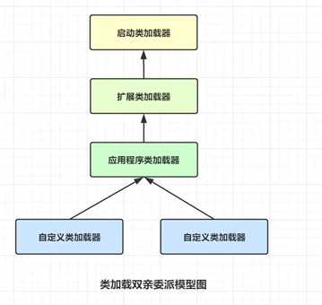
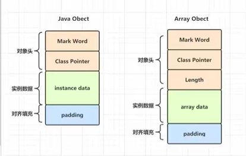

## 双亲委派机制
>双亲委派机制 ，保证类不会被重新加载，保护api包的安全。

## ClasssLoader的类加载顺序
**启动类--扩展类--应用程序类--自定义**

**jre/lib  jre/lib/ext  classpath    自定义**

>当多个服务不同jar包时，加载的是应用程序加载器加载 ，相同的包名不同的类加载器加载，类是不一样的。  JVM会把应用程序类加载赋值给当前线程
打破双亲委派模型，就是由自己指定类加载器

## OSGI
>网状的类加载器模型，破坏双亲委外模型

## 类加载机制
**加载--验证--准备--解析--初始化--使用--卸载**
1. 加载：读取此类的二进制字节流到JVM内部，并存储在运行时内存区的方法区，然后将其转换为一个与目标类型对应的java.lang.Class对象实例
2. 验证：类数据信息是否符合JVM规范，是否是一个有效的字节码文件，验证内容涵盖了类数据信息的格式验证、语义分析、操作验证，符号引用验证等。
3. 准备：为类中的所有静态变量分配内存空间，并为其设置一个初始值（得到类或者字段、方法在内存中的指针或者偏移量，以便直接调用该方法）,基本类型和字符串常量会在准备阶段就赋值。
4. 解析：将常量池中的符号引用转为直接引用（能确认地址）
5. 初始化：将一个类中所有被static关键字标识的代码统一执行一遍，如果执行的是静态变量，那么就会使用用户指定的值覆盖之前在准备阶段设置的初始值，如果执行的是static代码块，那么在初始化阶段，JVM就会执行static代码块中定义的所有操作。（main方法，new,子类初始化，static）。反射会对类没有进行初始化，需要触发其初始化。8中default 关键字修饰的接口方法，如果有这个接口的实现类发生了初始化，那该接口要在其之前被初始化。
6. 卸载： 在 JVM 生命周期内，由 jvm 自带的类加载器加载的类是不会被卸载的。但是由我们自定义的类加载器加载的类是可能被卸载的。
   - 该类的所有的实例对象都已被 GC，也就是说堆不存在该类的实例对象。
   - 该类没有在其他任何地方被引用
   - 该类的类加载器的实例已被 GC
   
````
                    准备     初始化    运行时
int a = 3;           0         0         3
static int a = 3;    0         3         3
final int a = 3;     3         3         3
````

## 对象的创建过程？new的过程
1. Step1:类加载检查

虚拟机遇到一条 new 指令时，首先将去检查这个指令的参数是否能在常量池中定位到这个类的符号引用，并且检查这个符号引用代表的类是否已被加载过、解析和初始化过。如果没有，那必须先执行相应的类加载过程。
2. Step2:分配内存

在类加载检查通过后，接下来虚拟机将为新生对象分配内存。对象所需的内存大小在类加载完成后便可确定，为对象分配空间的任务等同于把一块确定大小的内存从 Java 堆中划分出来。分配方式有 “指针碰撞” 和 “空闲列表” 两种，选择哪种分配方式由 Java 堆是否规整决定，而 Java 堆是否规整又由所采用的垃圾收集器是否带有压缩整理功能决定。
3. Step3:初始化零值

内存分配完成后，虚拟机需要将分配到的内存空间都初始化为零值（不包括对象头），这一步操作保证了对象的实例字段在 Java 代码中可以不赋初始值就直接使用，程序能访问到这些字段的数据类型所对应的零值。
4. Step4:设置对象头

初始化零值完成之后，虚拟机要对对象进行必要的设置，例如这个对象是哪个类的实例、如何才能找到类的元数据信息、对象的哈希码、对象的 GC 分代年龄等信息。 这些信息存放在对象头中。 另外，根据虚拟机当前运行状态的不同，如是否启用偏向锁等，对象头会有不同的设置方式。
5. Step5:执行 init 方法

从虚拟机的视角来看，一个新的对象已经产生了，但从 Java 程序的视角来看，对象创建才刚开始，<init> 方法还没有执行，所有的字段都还为零。所以一般来说，执行 new 指令之后会接着执行 <init> 方法，把对象按照程序员的意愿进行初始化，这样一个真正可用的对象才算完全产生出来。

**父类的类构造器<clinit>() -> 子类的类构造器<clinit>() -> 父类的成员变量和实例代码块 -> 父类的构造函数 -> 子类的成员变量和实例代码块 -> 子类的构造函数。**

**对象初始化的顺序：**
1. 首先是类加载，类加载的过程中为静态变量初始化，以及载入静态方法（先加载父类，再加载子类）
2. 其次是调用static代码块，static代码块的作用是为静态变量赋值，可以调用静态方法（先调用父类的，再调用子类的）
3. 然后是初始化对象，先执行非静态代码块，再执行构造函数（也是先调用父类的再调用子类的）

````
可以分为两个阶段会好理解一点；
第一个阶段是类加载及初始化：
先加载父类，再加载子类
首先把所有的类加载进来之后，从父类开始依次向下的初始化类变量。（初始化变量意思是指的，将变量的值设置为程序中所直接 int a = 10，这样的常量。就直接变为10，如果没有写明的话，初始化为零值）

第二个阶段是对象初始化：
执行静态代码块，从父类到子类，这个过程在程序运行时期只会执行一次，执行的时刻是在new这个类的对象之前的时候执行static代码块，并不是在类的加载之后又立马执行。
对象初始化的话，也是从父类开始初始化，父类初始化完成之后再初始化子类。（先执行父类的非static代码块，然后构造函数，然后子类的非static代码块，构造函数）

如果有main方法的话：
父类静态代码块->子类静态代码块->main方法->父类代码块->父类构造方法->子类代码块->子类构造方法
````

## 字节码指令
- `i++` 是先iload再iinc  ++i是先iinc再iload
- `istore`存入 iload载入  iadd 加
- `checkcast` 强制类型转换
- `invokeStaic` 静态方法 invokespecial 私有方法  invokeVirtual 公共方法

````
HSDB查找类信息的图形工具  
javap -v :反编译class字节码
ClassWrite 用于生成二进制字节码，框架中会使用产生代理类-cglib代理。
````
Short范围内的数据存在字节码中（元数据），超过的存在常量池中（堆）

## 内存分配的两种方式
- 指针碰撞 ：

适用场合 ：堆内存规整（即没有内存碎片）的情况下。 
原理 ：用过的内存全部整合到一边，没有用过的内存放在另一边，中间有一个分界指针，只需要向着没用过的内存方向将该指针移动对象内存大小位置即可。
使用该分配方式的 GC 收集器（标记-整理）：Serial, ParNew

- 空闲列表 ：

适用场合 ： 堆内存不规整的情况下。
原理 ：虚拟机会维护一个列表，该列表中会记录哪些内存块是可用的，在分配的时候，找一块儿足够大的内存块儿来划分给对象实例，最后更新列表记录。
使用该分配方式的 GC 收集器（标记-清除）：CMS

>选择以上两种方式中的哪一种，取决于 Java 堆内存是否规整。而 Java 堆内存是否规整，取决于 GC 收集器的算法是"标记-清除"，还是"标记-整理"（也称作"标记-压缩"），值得注意的是，复制算法内存也是规整的。

## 内存分配并发问题
>在创建对象的时候有一个很重要的问题，就是线程安全，因为在实际开发过程中，创建对象是很频繁的事情，作为虚拟机来说，必须要保证线程是安全的，通常来讲，虚拟机采用两种方式来保证线程安全：

- CAS+失败重试： 

CAS 是乐观锁的一种实现方式。所谓乐观锁就是，每次不加锁而是假设没有冲突而去完成某项操作，如果因为冲突失败就重试，直到成功为止。虚拟机采用 CAS 配上失败重试的方式保证更新操作的原子性。
- TLAB： 

为每一个线程预先在 Eden 区分配一块儿内存，JVM 在给线程中的对象分配内存时，首先在 TLAB 分配，当对象大于 TLAB 中的剩余内存或 TLAB 的内存已用尽时，再采用上述的 CAS 进行内存分配

## 编译优化技术
**JIT,即时编译器**

- 语言无关的经典优化技术之一：公共子表达式消除。
- 语言相关的经典优化技术之一：数组范围检查消除。
- 最重要的优化技术之一：方法内联   更像是方法合并
- 最前沿的优化技术之一：逃逸分析  分析内部数据会不会被外部使用，没有不需要创建

## 反射性能差
1. 需要包装和反包装
2. 需要检验参数
3. 需要检验权限
4. 无法使用jit
5. 无法内联

## 深拷贝、浅拷贝
浅拷贝并不是真的拷贝，只是复制指向某个对象的指针，而不复制对象本身，新旧对象还是共享同一块内存。

深拷贝会另外创造一个一模一样的对象，新对象跟原对象不共享内存，修改新对象不会改到原对象。

## 对象的内存布局
**对象在内存中的布局包括三部分：对象头，实例数据和对齐填充**

Hotspot 虚拟机的对象头包括两部分信息，第一部分用于存储对象自身的运行时数据（哈希码、GC 分代年龄、锁状态标志等等），另一部分是类型指针，即对象指向它的类元数据的指针，虚拟机通过这个指针来确定这个对象是哪个类的实例。

实例数据部分是对象真正存储的有效信息，也是在程序中所定义的各种类型的字段内容。

对齐填充部分不是必然存在的，也没有什么特别的含义，仅仅起占位作用。 因为 Hotspot 虚拟机的自动内存管理系统要求对象起始地址必须是 8 字节的整数倍，换句话说就是对象的大小必须是 8 字节的整数倍。而对象头部分正好是 8 字节的倍数（1 倍或 2 倍），因此，当对象实例数据部分没有对齐时，就需要通过对齐填充来补全。




>int 4个字节byte，一个字节占8位。

>Integer  压缩对象指针：8(markword)+4(oop)+4(int)=16，不压缩：8+8+4+4（对其填充，需要8倍）=24
